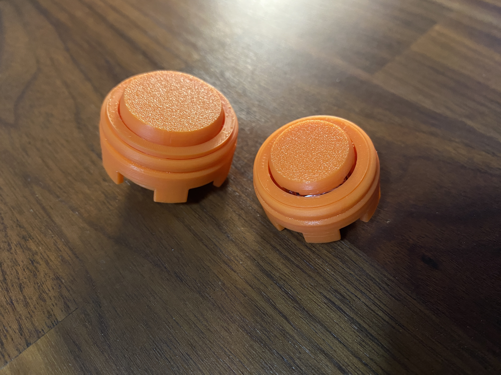
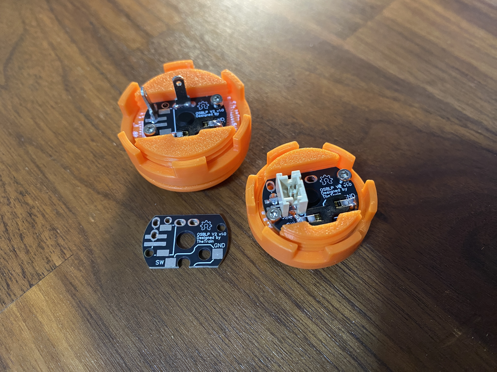
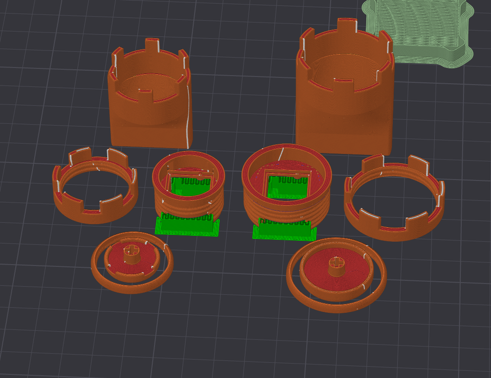

## OSBLP v2 - 24mm + 30mm - Open Source Button LP v2

---

!!!WARNING!!!

I am not responsible for prints that do not turn out as intended or any damages that occur as a result of installation or usage of these buttons.

!!!WARNING!!!

There are a growing number of Choc v2 LP switches coming onto the market.  For the purposes of this project I focused on `Kailh Red` switches.  While you may be able to use all sorts of other switches in these, I cannot guarantee that any other switches will work.  It is highly recommended to try a switch or two out to ensure proper operation before buying a ton of them.

!!!WARNING!!!

These buttons are not compatible with SiTong caps.  I may work on a remix that is.

!!!WARNING!!!

These take brand new boards.  You will not be able to use board from the OSBMX v2.

!!!WARNING!!!

This button requires printed supports.

!!!WARNING!!!

---

## Attribution

The following text must be included in any distribution of derivatives of this project or the boards. All links must also be included.

Based on the OSBLP v2 by TheTrain.

Copyright © 2025 [TheTrain](http://x.com/thetrain24) 

[Licensed under CC BY 4.0](https://creativecommons.org/licenses/by/4.0/)

Changes from the original design:
  - list any changes you make here

Anyone selling this commercially must include in the listing that this is an open source item, link to the original repo and include the copyright as well as the link to my X account.

---

## Summary

The OSBLP v2 was designed from scratch in Fusion360 based on the OSBMX v2.  

We have seen a growing number of low profile switch buttons in the last few years and this is an open source button to go along with them.

There are now much more affordable and high quality options available commercially like the SiTong MX and LP buttons.

The OSBLP v2 is focused simply on 3D printing though home FDM printers.  These have not been tested through services like JLCPCB in materials like MJF, SLS or resin.  I may add some remixes that are more suitable to those materials in the future.

If you are planning to use these with the PCB included in the repo please be sure to research which switches will and will not work.  I am unable to answer questions on individual switch compatibility.

Please note that these buttons can also be used without the circuit board as the main housing of the button will hold the LP switches just fine.  You can then use a hot swap connector directly or just solder to the LP switches.  It is recommeded to use a PCB.

A massive thank you to LayerShift (https://x.com/Layer_Shift) for helping get the Fusion360 model all cleaned up on the OSBMX v2 which was used as the base for the OSBLP v2.

---

## Board design choices

There is a new PCB design for the OSBLP v2.

The new PCB design combines the three most common methods of connection into one board:
- 2.8mm prong connector
- Solder pads
- PH2.00mm 2pin connector

---

## Assembly

Assembly is quite straight forward on this board.  All that is needed is to solder the hot swap socket on and, if you choose, the 2.4mm or PH2.00mm 2pin connector(s)

Parts necessary for assembly of the PCBs:

1 x PCB 
1 x LP hot swap socket (https://www.aliexpress.com/item/1005006625852715.html) 
1 x PH2.00mm 2pin vertical SMD connector (if connecting that way) (https://www.aliexpress.com/item/1005006027334406.html) 
2 x 2.8mm prong connectors (if connecting that way) (https://www.aliexpress.com/item/1005002539360973.html) (Type: DJ610-2.8-2) 
2 x M2 5mm Hex Hexagon Socket Cap Head Self Tapping Screws (https://www.aliexpress.com/item/10000350027047.html) 

Parts necessary for assembly of 3D printed button:

1 x OSBLP v2 Plunger 
1 x OSBLP v2 Rim 
1 x OSBLP v2 Main Body 
1 x OSBLP v2 Nut 

Optionally you can also print a matching wrench to help with tightning and untighning.

You will also need a Choc v2 LP switch to complete the button.

Not all switches have been tested, there may be some that do not follow the above rules.

---

## How to order a PCBs:

All of the boards so far have been ordered though JLCPCB.  Due to the size of the boards you can order quite a lot at very low cost.  I was able to order 125 of them and still meet their minimum shipping cost limits.  You do not need to get this many.  I have also opted not to do a panel for this since it appears to still be cheaper to get these done individually.  Also please note that recently JLCPCB changed some of their prices for the PCB color, ensure you choose a color like black or green to get the lowest possible cost.

1 - Go to JLCPCB.com 
2 - Click on `Instant Quote` 
3 - Click on `Add Gerber file` and choose the file named `Gerber - OSBLP v2.0 multi-connector.zip` 
4 - Choose the following options for the board: 
- Base Material = FR-4 
- Layers = 2 
- Dimensions = (should auto-populate) 22 * 14 mm 
- PCB Qty = 100 
- Product Type = Industrial/Consumer electronics 
- Deburring/Edge Rounding = Yes 
- Different Design = 1 
- Delivery Format = Single PCB 
- PCB Thickness = 1.6 
- PCB Color = (up to you) 
- Silkscreen = (defaults to white for all except white boards which is black) 
- Surface Finish = HASL(with lead) 
- Outer Copper Weight = 1oz 
- Via Covering = Tented 
- Min via hole size/diameter = 0.3mm/(0.4/0.45mm) 
- Board Outline Tolerance = +/- 0.2mm(Regular) 
- Confirm Production file = No 
- Mark on PCB = Remove 
- Flying Probe Test = Fully Test 
- Gold Fingers = No 
- Castellated Holes = No 
- Edge Plating = No 
- No advanced options 

5 - Click on `SAVE TO CART` 
6 - Go through checkout process, ensure to select economic shipping to keep costs low

---

## How to print the OSBLP v2:

A .3MF file is included which can be loaded into most slicers with a set of my recommended settings.  

To make each button you will need:
1 x OSBLP v2 Plunger 
1 x OSBLP v2 Rim 
1 x OSBLP v2 Main Body 
1 x OSBLP v2 Nut 

The rim should be printed flat side down.  The nut should also be printed flat side down.  

You will need supports for these buttons. 

It is recommended to print at the lowest print layer height your printer can do.  

I have extensivly printed and tested these on my BambuLabs X1C and P1S using both a 0.4mm and 0.2mm nozzle on normal and matte PLA.  

The recommended print setting are to do 4-6 wall loops and then enough top and bottom laters to have solid infill.  

You may need to adjust to achieve a good print on your own printer.  

!!!Please note - I am not responcible for missprints or any costs incured from missprints!!!

---

## Other stuff

The original jig file from the OSBMX v2 will no longer work.  I do not have immediate plans to make a new jig.

---

## Donations

Every part of this project is open source, all prototyping costs were covered out of pocket.

Donations are not necessary but always welcome!  All received donations go into trying new things and ordering new boards for this and other projects.

https://www.paypal.com/donate/?hosted_button_id=2JMTZVCGLDYC2

---

Revision History:

v2.0
- Conversion to LP design

v1.0
- Original OSBMX design