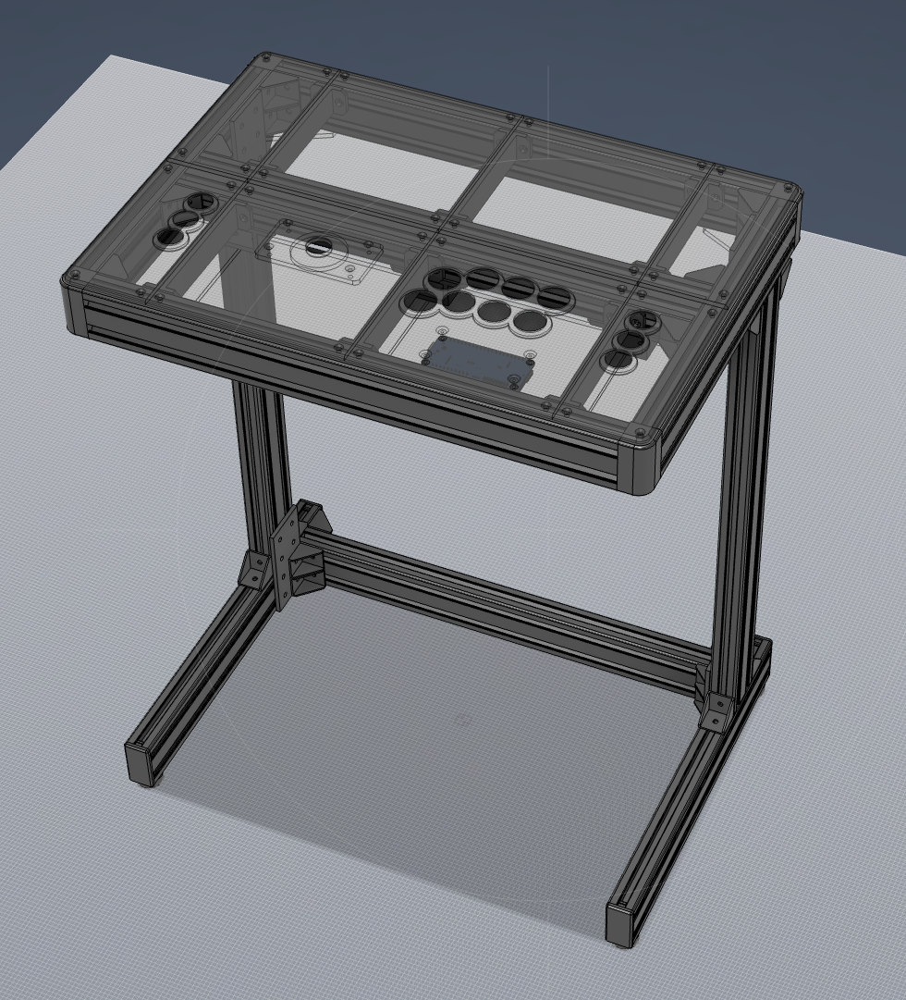
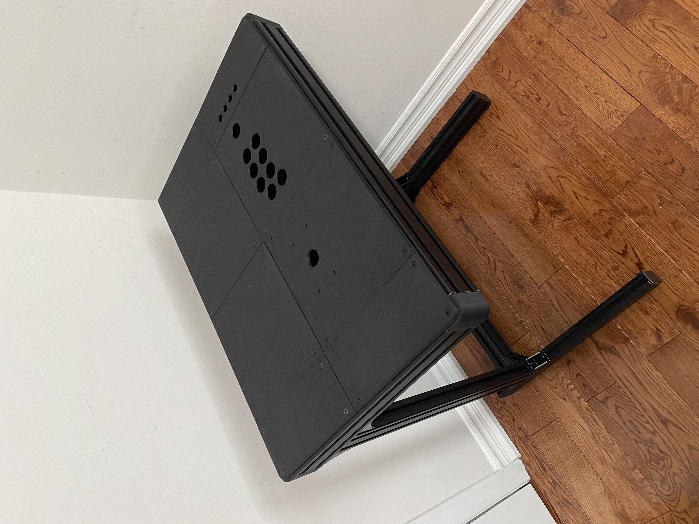
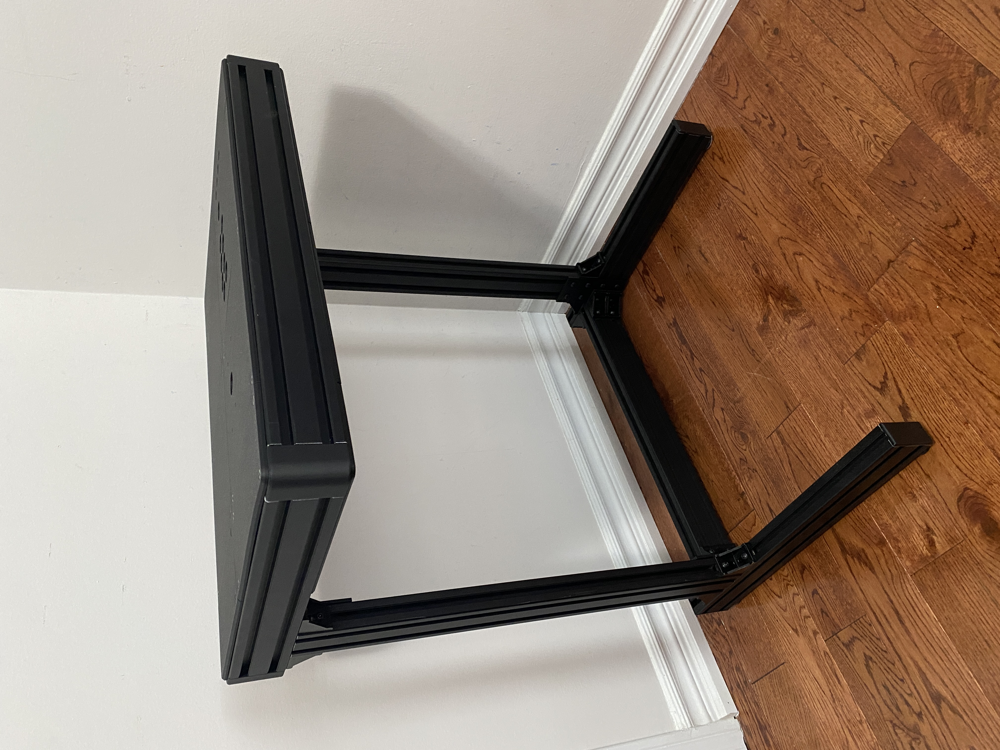
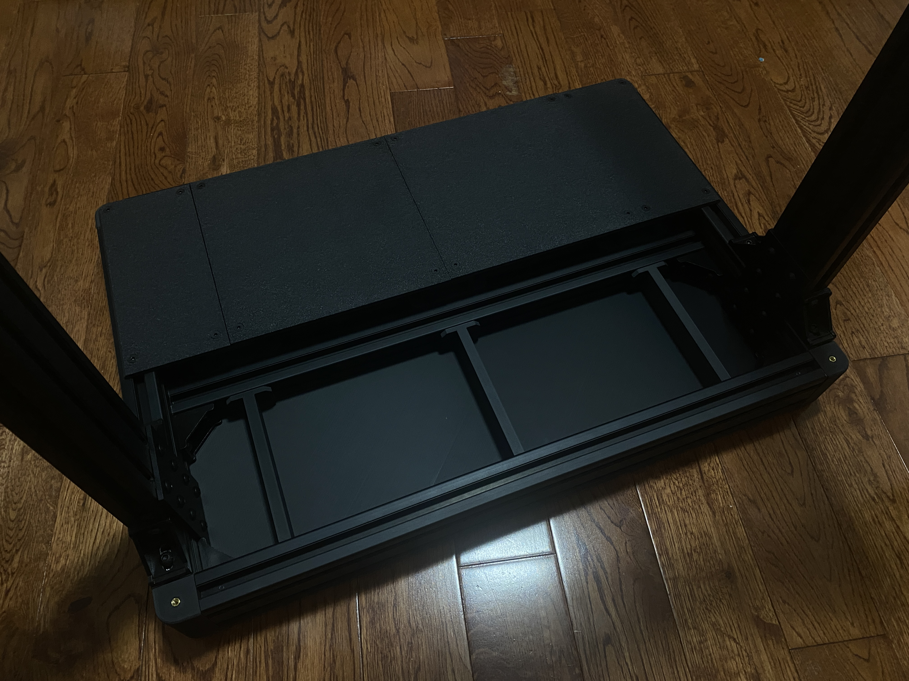

# Open Source Arcade Stand (OSAS)

---

## Attribution

The following text must be included in any distribution of derivatives of this project. All links must also be included.

Based on the Open Source Arcade Stand (OSAS) by TheTrain.

Copyright © 2026 [TheTrain](http://x.com/thetrain24) 

[Licensed under CC BY 4.0](https://creativecommons.org/licenses/by/4.0/)

Changes from the original design:
  - list any changes you make here

Anyone selling this commercially must include in the listing that this is an open source item, link to the original repo and include the copyright as well as the link to my X account.

---

## Warnings / Disclaimer:

This is a very difficult project that should not be attempted by the vast majority of people.  I will not offer any troubleshooting or support for this project so please ensure this is something you want to take on before starting.

Please note the following warnings / disclaimer:
- It is not recommended to sit, stand, jump on or put your full weight on the unit.  I am not responsible for injuries that occur as a result of you using or attempting to use the OSAS
- I am not responsible for prints that fail or do not turn out as intended.
- I am not responsible for any damage that happens to your printer or parts of your printer as a result of printing these files.
- If you make and sell these units you are responsible for supporting your own customers.
- Getting good aluminum profile cuts is critical to the success of this project.  The worse your cuts the harder this project will be!
- It may be possible to 3D print the aluminum extrusion parts and attach them but I have not tested this, will not be testing this and do not recommend it.
- There are a significant number of parts and accessories that you will need to get to complete this project.
- Extensive research into part availability is needed prior to attempting this project.
- This will not do too well on a wobbly or uneven surface without making adjustments to the feet model or coming up with a new solution for the feet.

## Summary:

The Open Source Arcade Stand was an idea I had following the Qanba 2009 to bring a small sized arcade setup into the community allowing people to make units that may have smaller spaces.

Unlike many of my project this one is large and can be quite expensive.  

The OSAS is fully modular and it is very easy to make modifications or new panels for it. 

This project cost me around $250 USD but your costs may be different.  Please reasarch it fully before jumping in.

---

## Printing and Parts Needed:

The OSAS will take around 2,000g (or 2x normal 1kg spools) of material to complete.  While there are some parts like the bottom covers that could be omitted, you will need more than one spool at a minimum to complete the project.

Please note that I am not taking on requests for other layouts at this time.  The STLs and STEP files have been posted so you can be easily edited in TinkerCAD or Fusion360 (or the program of your choice).

This case was printed on a Bambu Labs X1C and P1S printer with the following changes to settings:
- 0.20mm layer height
- 4 outer walls
- Hex infill
- 15% infill
- Hilbert Curve bottom layer

Please note that Hilbert Curve will add a significant amount of print time to this project but does yield the best visual results in my opinion.  

The following aluminum profile parts are needed:
- 4x 54cm (540mm) European Standard 3060 T Slot Aluminum Extrusion Profile 
- 2x 58cm (580mm) European Standard 3060 T Slot Aluminum Extrusion Profile
- 2x 42cm (420mm) European Standard 3060 T Slot Aluminum Extrusion Profile
- 2x 36cm (360mm) European Standard 3060 T Slot Aluminum Extrusion Profile

The following hardware is needed to assemble the case:
- 4x 3060 Black Plastic end Cap Covers (https://www.aliexpress.com/item/1005007316830988.html)
- 4x 8 Hole Black-6060 Aluminum Plates (https://www.aliexpress.com/item/1005009384439043.html)
- 100x Black M4 14mm Countersunk Bolts (https://www.aliexpress.com/item/32800975883.html)
- 100x Sliding T Slot Nut 3030-M4 (https://www.aliexpress.com/item/1005007587044629.html)
- 50x Sliding T Slot Nut 3030-M6 (https://www.aliexpress.com/item/32964780472.html)
- 10x Black M6 16mm Button Bolts (https://www.aliexpress.com/item/32810852732.html)
- 30x Black M6 12mm Button Bolts (https://www.aliexpress.com/item/32810852732.html)
- 4x M4 60mm Brass Standoff (https://www.aliexpress.com/item/1005006049595637.html)
- 1x 26 piece 3030 Aluminum Profile Corner Bracket Kit (https://www.amazon.ca/dp/B0CLXXZXKY)

I also recommend putting some of those little furnature pads on the bottom of the feet.  I got a small pack from a local dollar store.

---

## Assembly and Construction:

I can really only offer tips for this.  There will be no step-by-step instructions for assembly but I will list some tips here:
- I would highly recommend doing the assembly of the top and bottom frame on a flat surface.  I used my kitchen countertop.
- I would also recommend getting parts loosely positioned first and then going back to tighten everything up.
- It is going to take a lot of time to get the main frame positioned and aligned correctly.
- I don't have a good solution for the bottom feet.  If you don't have a flat place where it will be sitting you will need to come up with some new models or adjust the feet model.

---

## Donations and Support

Donations are welcome and will be used to further refine the files, test additional parts and work on other layouts that interest me.

You can donate here: https://www.paypal.com/donate/?hosted_button_id=2JMTZVCGLDYC2
