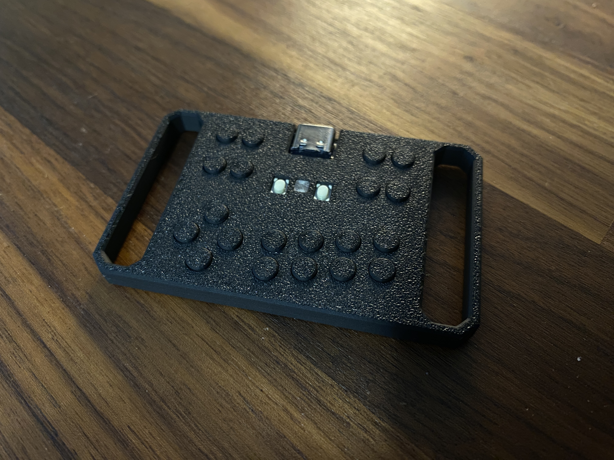

# Mini Pad v1.0

---

## Attribution

The following text must be included in any distribution of derivatives of this board. All links must also be included.

Based on the Mini Pad from the GP2040-CE project located at https://github.com/OpenStickCommunity/Hardware/tree/main/Boards/GP2040-CE%20Official%20Controllers/Mini%20Pad

Copyright 2024 [TheTrain](https://github.com/TheTrainGoes)

[Licensed under CC BY 4.0](https://creativecommons.org/licenses/by/4.0/)

Changes from the original design:
  - list any changes you make here

## Summary

The Mini Pad is another of my small controllers (made mainly for fun).  This one will be a lot more approachable for most people since you can have the tactile switches assembled by JLC.

A few immediate notes before you begin this project:
1 - You should have a 3D printer with a 0.2mm nozzle, and be prepared for miss-prints (some have tried 0.4mm with varied success)
2 - This is just a `for fun` thing!  This is not designed to be a serious controller.

The Mini Pad is based around a soldered on Waveshare RP2040 Zero.  You could have JLC assemble these but it is not worth the price IMO.  I have not included it in the BOM for this reason.  You can also use the generic Zero units found on AliExpress but please ensure you use one with the same top button layout as the original Zero since the case has button placement for them.

The Pocket Pad uses the normal Waveshare Zero GP2040-CE configuration with a few changes.  If there is demand I will make a dedicated config for it.  The changes are:
1 - RGB -> GPIO16

There are two additional buttons in the top left mapped to GPIO28 and GPIO29.

The Aux buttons are as follows:

| GPIO28 | GPIO29 |    | Start | Select  |
| L3     | R3     |    | Home  | Capture |

We have a small but passionate Discord group which you can access here, if interested: https://discord.com/invite/k2pxhke7q8

## Board and case design choices

This is a fairly straight-forward design.  It features a broken out Waveshare RP2040 Zero and tiny little switches.

The Case was deisnged to be snap together so no screws are needed.

## Assembly

You will also need the following hardware components to finish the Mini Pad once you get it from AliExpress:
- Waveshare RP2040 Zero or clone (found commonly on Amazon and AliExpress)

You will need to 3D print the following parts:
- 1x [Main Body (type 1)](3D%20print%20files/Mini%20Pad%20-%20Main%20Body%20(type%201).stl)
- 1x [Bottom Cover](3D%20print%20files/Mini%20Pad%20-%20Bottom.stl)
- 20x [Button](3D%20print%20files/Mini%20Pad%20-%20Button.stl)
- 1x [LED Inserts](3D%20print%20files/Mini%20Pad%20-%20LED%20Insert.stl)

Optionally, you can also print the second design of the fram:
- 1x [Main Body (type 2)](3D%20print%20files/Mini%20Pad%20-%20Main%20Body%20(type%202).stl)

You can also try one of two different designs for side inserts:
- 1x [Side Insert (type 1)](3D%20print%20files/Mini%20Pad%20-%20Side%20Insert%20(type%201).stl
- 1x [Side Insert (type 2)](3D%20print%20files/Mini%20Pad%20-%20Side%20Insert%20(type%202).stl)

## How to order a board

All of the boards so far have been ordered though JLCPCB.  Due to minimum order numbers you would get five of these basic breakout boards.  Here are the steps to make your first order and what options I choose along the way.

1 - Go to JLCPCB.com 

2 - Click on `Instant Quote` 

3 - Click on `Add Gerber file` and choose the file named `Gerber - Pocket Pad v1.0.zip` from the `Hardware files` folder 

4 - Choose the following options for the board: 
- Base Material = FR-4 
- Layers = 2 
- Dimensions = (should auto-populate) 48 mm x 40 mm 
- PCB Qty = (however large your run will be, minimum of 5) 
- Product Type = Industrial/Consumer electronics 
- Different Design = 1 
- PCB Thickness = 1.6 
- PCB Color = (up to you) 
- Silkscreen = (defaults to white for all except white boards which is black) 
- Surface Finish = HASL(with lead) 
- Outer Copper Weight = 1oz 
- Via Covering = Tented 
- Board Outline Tolerance = +/- 0.2mm (Regular) 
- Confirm Production file = No 
- Remove Order Number = Yes (note 1) 
- Flying Probe Test = Fully Test 
- Gold Fingers = No 
- Castellated Holes = No 
- No advanced options 

Note 1 - This is now free to remove on JLC!

5 - Choose the following options for the PCB assembly
- PCBA Type = Economic (note 2) 
- Assembly Side = Top Side 
- PCBA Qty = (however large your run will be, minimum of 2) 
- Tooling holes = Added by Customer 
- Confirm Parts Placement = Yes (note 3) 

Note 2 - Economic assembly is much cheaper on smaller batch runs of 10-30 units.  Standard assembly will yield less dead on arrival boards but is more expensive to have done.  These boards are extreamly simple and I do not expect assembly issues with them.

Note 3 - This adds around $1 to the total cost of the order and is 100% worth doing as they will check the placement of all SMD parts and make any necessary changes or reach out if there are concerns.  I cannot stress enough that this is the best $1 you will spend for the peace of mind of not messing up an entire batch.

6 - Make sure you have read the terms and conditions of JLCPCB assembly service and then click on the `Confirm` button if you agree  

7 - The Bill of Materials page will show you a render of the board without parts.  You can click the `NEXT` button here unless you see any issues with the board 

8 - You will now have the option to upload two files:
- For the `Add BOM File` you will need to choose the `BOM - Mini Pad v1.0.csv` file that is located in the Hardware files folder
- For the `Add CPL File` you will need to choose the `CPL - Mini Pad v1.0.csv` file that is located in the Hardware files folder 
Once these two files have been uploaded you can press the `Process BOM & CPL` button. 

9 - You will now see a list of components that will be used to assemble the boards.  If there are no listed issues here you can click on on the `NEXT` button. 

10 - There will now be a render of the board with parts on the Component Placements page.  Check this page to make sure that all parts are in the correct spots and orientation.  We have ordered based on these files before and they are known to be good.  If all looks well press the `NEXT` button. (note 8)

Note 8 - Please note that we are not responsible for boards made by JLCPCB or any other manufacturer that do note work.

11 - The quote & order page will give you a breakdown of the costs associated with the boards and assembly parts based on the quantity you have chosen. This does not include shipping.  Shipping will be calculated at a further step. 
- For Product Description I typically choose `Other` `Other` and type in `Controller board`.

If all looks well here you can click on the `SAVE TO CART` button.

12 - The `Secure Checkout` process will be different based on your location in the world.  We recommend researching your shipping options to choose the one that is right for your application.  If you are planning to also order the aluminum bottom plate then please check out the following section before placing your order.

If all looks well here you can click on the `SAVE TO CART` button.

13 - The `Secure Checkout` process will be different based on your location in the world.  We recommend researching your shipping options to choose the one that is right for your application.  If you are planning to also order the aluminum bottom plate then please check out the following section before placing your order.

## Sales recommendations

Through the licencing you are free to make and sell these boards in group buys or even commercial applications.  

These boards take a long time to make and line up so I doubt many vendors will want to sell them.  They are designed to be a fun thing not a serious product.

The intended purpose of this board, as well as the overall GP2040-CE project is to get low cost boards into the hands of as many people as possible to everyone can enjoy the project.  

You are free to set your own price as you see fit. 

If you are a seller on Etsy I have an expectation that you will add proper attributon and add a link to the Open Source repo in your listing.

## Donations

Every part of this project is open source, from the GP2040-CE firmware to the original Pico Fighting Board design and also this Pocket Pad design.  

Donations are not necessary but always welcome!  I typicly use donations to pay for Discord boosts and try out new designs or send boards to people for testing, iterations and helping people get board setups that might not be in an economic position to get one themselves.

https://www.paypal.com/donate/?hosted_button_id=2JMTZVCGLDYC2

## Revision History

v1.0
- Innitial design

## Acknowledgements

- [TheTrain](https://github.com/TheTrainGoes) for the board design
- Everyone that works on the GP2040-CE project to make it the best controller firmware around