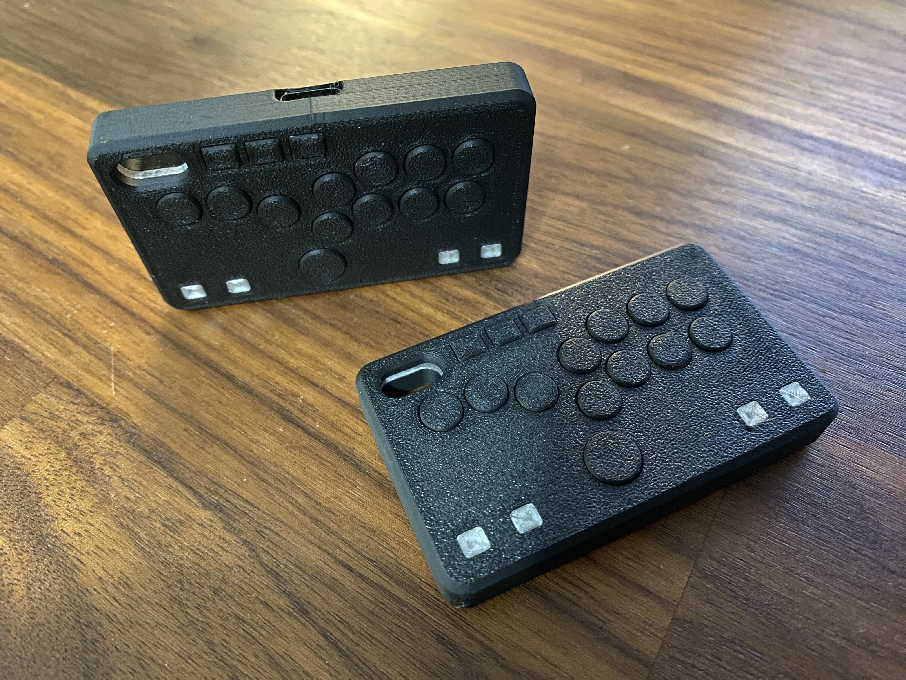

# Pocket Pad v1.0

---

## Attribution

The following text must be included in any distribution of derivatives of this board. All links must also be included.

Based on the Pocket Pad from the GP2040-CE project located at https://github.com/OpenStickCommunity/Hardware/tree/main/Boards/GP2040-CE%20Official%20Controllers/Pocket%20Pad

Copyright 2024 [TheTrain](https://github.com/TheTrainGoes)

[Licensed under CC BY 4.0](https://creativecommons.org/licenses/by/4.0/)

Changes from the original design:
  - list any changes you make here

## Summary

The Pocket Pad was a silly idea that has been bouncing around for a few years.  Recently there has been more demand for small pocket-type controllers so I figured it was time to release it.

A few immediate notes before you begin this project:
1 - You must have a 3D printer with a 0.2mm nozzle, and be prepared for lots of miss-prints (this thing is tiny and tolerances are very small)
2 - You will need to be extremely careful with top side button placements, if any of the aux buttons are incorrectly placed it may affect their operation
3 - This is just a `for fun` thing!  This is not designed to be a serious controller.

The Pocket Pad is based around a soldered on RP2040 Super Mini.  It is designed to be hand soldered but I have included the BOM and CPL if you want to try those.  I have not tested an assembly version of this so YMMV and no instructions will be provided. 

Please note that the RGB LEDs are optional, same with the caps.

The Pocket Pad uses the normal Waveshare Zero GP2040-CE configuration with a few changes.  If there is demand I will make a dedicated config for it.  The changes are:
1 - RGB -> GPIO28
2 - Function key -> GPIO29
3 - Add a hotkey of `FN` + `S2` -> `A1`
4 - Add a hotkey of `FN` + `S1` -> `A2`

We have a small but passionate Discord group which you can access here, if interested: https://discord.com/invite/k2pxhke7q8

## Board and case design choices

This is a fairly straight-forward design.  It features a broken out Super Mini, RGB LEDs and tiny little switches.

The Case was designed to be snapped together so no screws are needed.

## Assembly

You will also need the following hardware components to assemble the Pocket Pad:
- RP2040 Super Mini board (found commonly on Amazon and AliExpress)
- 12x SMD 2 Pin 3X4MM Tactile Switches [AliExpress Link](https://www.aliexpress.com/item/32698846968.html)
- 4x SK6812 MINI-E RGB LEDs [AliExpress Link](https://www.aliexpress.com/item/4000475685852.html)
(There are 4x C1525 [100nF] caps but I would skip those unless you are having these assembled)

You will need to 3D print the following parts:
- 1x [Main Body](3D%20print%20files/Pocket%20Pad%20-%20Main%20Body.stl)
- 1x [Mid-frame Insert](3D%20print%20files/Pocket%20Pad%20-%20Mid-frame%20Insert.stl)
- 1x [Bottom Cover](3D%20print%20files/Pocket%20Pad%20-%20Bottom%20Cover.stl)
- 1x [Aux Buttons](3D%20print%20files/Pocket%20Pad%20-%20Aux%20Buttons.stl)
- 11x [Small Button](3D%20print%20files/Pocket%20Pad%20-%20Small%20Button.stl)
- 1x [Large Button](3D%20print%20files/Pocket%20Pad%20-%20Large%20Button.stl)
- 4x [LED Inserts](3D%20print%20files/Pocket%20Pad%20-%20LED%20Inserts.stl)

It is recommended to do the 4x LED inserts out of something translucent for best effect.  If you don't want to have LEDs you can print blanks to insert.

## How to order a board

All of the boards so far have been ordered though JLCPCB.  Due to minimum order numbers you would get five of these basic breakout boards.  Here are the steps to make your first order and what options I choose along the way.

1 - Go to JLCPCB.com 

2 - Click on `Instant Quote` 

3 - Click on `Add Gerber file` and choose the file named `Gerber - Pocket Pad v1.0.zip` from the `Hardware files` folder 

4 - Choose the following options for the board: 
- Base Material = FR-4 
- Layers = 2 
- Dimensions = (should auto-populate) 58.5 mm x 33.2 mm 
- PCB Qty = (however large your run will be, minimum of 5) 
- Product Type = Industrial/Consumer electronics 
- Different Design = 1 
- PCB Thickness = 1.6 
- PCB Color = (up to you) 
- Silkscreen = (defaults to white for all except white boards which is black) 
- Surface Finish = HASL(with lead) 
- Outer Copper Weight = 1oz 
- Via Covering = Tented 
- Board Outline Tolerance = +/- 0.2mm (Regular) 
- Confirm Production file = No 
- Remove Order Number = Yes (note 1) 
- Flying Probe Test = Fully Test 
- Gold Fingers = No 
- Castellated Holes = No 
- No advanced options 

Note 1 - This is now free to remove on JLC!

If all looks well here you can click on the `SAVE TO CART` button.

5 - The `Secure Checkout` process will be different based on your location in the world.  We recommend researching your shipping options to choose the one that is right for your application.  If you are planning to also order the aluminum bottom plate then please check out the following section before placing your order.

## Sales recommendations

Through the licensing you are free to make and sell these boards in group buys or even commercial applications.  

These boards take a long time to make and line up so I doubt many vendors will want to sell them.  They are designed to be a fun thing not a serious product.

The intended purpose of this board, as well as the overall GP2040-CE project is to get low cost boards into the hands of as many people as possible so everyone can enjoy the project.  

You are free to set your own price as you see fit. 

If you are a seller on Etsy I have an expectation that you will add proper attribution and add a link to the Open Source repo in your listing.

## Donations

Every part of this project is open source, from the GP2040-CE firmware to the original Pico Fighting Board design and also this Pocket Pad design.  

Donations are not necessary but always welcome!  I typically use donations to pay for Discord boosts and try out new designs or send boards to people for testing, iterations and helping people get board setups that might not be in an economic position to get one themselves.

https://www.paypal.com/donate/?hosted_button_id=2JMTZVCGLDYC2

## Revision History

v1.0
- Initial design

## Acknowledgements

- [TheTrain](https://github.com/TheTrainGoes) for the board design
- Everyone that works on the GP2040-CE project to make it the best controller firmware around
