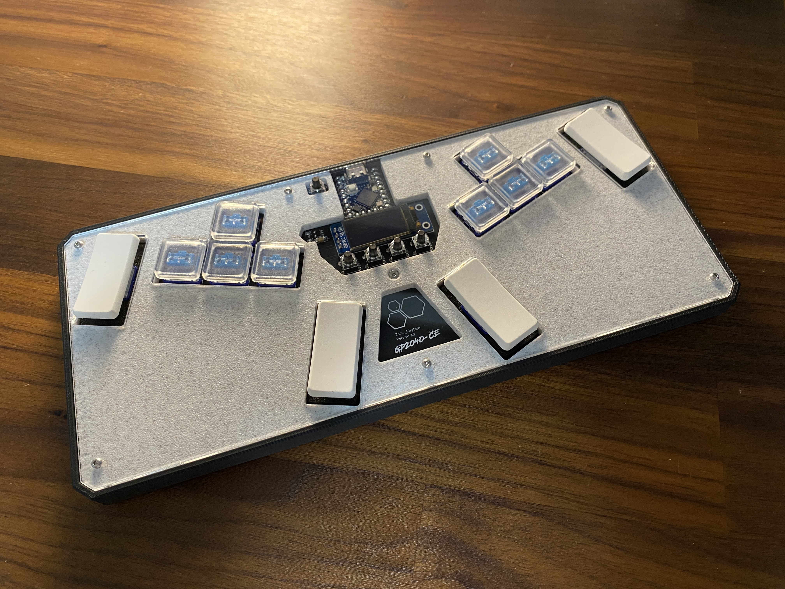

# Zero_Rhythm v1.0

---

## Attribution

The following text must be included in any distribution of derivatives of this board. All links must also be included.

Based on the Zero_Rhythm board from the GP2040-CE project located at https://github.com/OpenStickCommunity/Hardware/tree/main/Boards/GP2040-CE%20Official%20Controllers/Zero_Rhythm

Copyright 2023 [TheTrain](https://github.com/TheTrainGoes)

[Licensed under CC BY 4.0](https://creativecommons.org/licenses/by/4.0/)

Changes from the original design:
  - list any changes you make here

## Summary

The Zero_Rhythm was an idea I had while playing through the Theatrhythm demo on my Switch.  It allows you to play rhythm as well as dual stick games in a double WASD layout.  How good this actually is has yet to be proven.

A few immediate notes:
1 - The screen layout is not complete.  If I get around to making one I will update here and make a proper config for this.
2 - There ia no config for this, you will need to map the buttons yourself, they are listed here.

Zero_Rhythm is based around a soldered on Waveshare RP2040 Zero or the newer RP2040 Super Mini.  It is designed to be hand soldered and as such no BOM or CPL files are included.  It works with hot swap sockets, Choc v1 switches and caps and you can add LEDs if you like.

We have a small but passionate Discord group which you can access here, if interested: https://discord.com/invite/k2pxhke7q8

## Board design choices

This is a fairly straight-forward design.  It features a broken out Zero or Super Mini, RGB LEDs and an OLED.

## Assembly

These boards are designed to be hand assembled after you get the boards from JLC.

This design includes both SMD and through hole parts. 

You will also need the following hardware components to assembe the Zero_Rhythm:
- Waveshare RP2040 Zero or RP2040 Super Mini board (found commonly on Amazon and AliExpress)
- 0.96" OLED [AliExpress Link](https://www.aliexpress.com/item/1005003749784158.html) (make sure you get the module version)
Note: You will need to take off the plastic part of the header on it otherwise the plexi will not lay flush!  You will also need to snip the legs after soldered on.
- 8x M2x6mm spacer standoffs [AliExpress Link](https://www.aliexpress.com/item/1005003106030065.html)
- 1x M2x5mm countersunk bolts [AliExpress Link](https://www.aliexpress.com/item/32968097507.html)
- 7x M2x8mm buttonhead bolts [AliExpress Link](https://www.aliexpress.com/item/32967225441.html)
- 5x 6x6x11mm tactile switches (found commonly on Amazon and AliExpress)
- 12x Choc v1 switches
- 12x Choc v1 hotswap sockets
- 8x Choc v1 keycaps (normal 1U)
- 4x Choc v1 keycap (larger 2U)
- 4x Choc v1 2U stabilizer bars
- 1x 100nF cap (1206 size)
- 1x 10k resistor (1206 size)
- 1x 5v Logic shifter (SN74LV1T34DBVR)
- 12x SK6812 MINI-E RGB LEDs [AliExpress Link](https://www.aliexpress.com/item/4000475685852.html)

You will need to 3D print the following parts:
- 1x [Main case](3D%20print%20files/Zero_Rhythm%20v1.0%20-%20Main%20case.stl)
- 1x [Mid-plate insert](3D%20print%20files/Zero_Rhythm%20v1.0%20-%20Mid-plate%20insert.stl)
- 4x [2u stabilizer brackets](3D%20print%20files/Zero_Rhythm%20v1.0%20-%202u%20Stabilizer%20bracket.3mf)

You will also need to following laser cut (bottom foam optional):
- 1x [Top plexi](Laser%20cut%20files/Zero_Rhythm%20v1.0%20-%20Top%20plexi.svg)
- 1x [Bottom foam](Laser%20cut%20files/Zero_Rhythm%20v1.0%20-%20Bottom%20foam.svg)

* Please note that there is no BOM or CPL included.  Assembly for this board at JLC has not been tested and should not be done.

## How to order a board

All of the boards so far have been ordered though JLCPCB.  Due to minimum order numbers you would get five of these basic breakout boards.  Here are the steps to make your first order and what options I choose along the way.

1 - Go to JLCPCB.com 

2 - Click on `Instant Quote` 

3 - Click on `Add Gerber file` and choose the file named `Gerber - Open_Core0 WASD v2.0.zip` from the `Hardware files` folder 

4 - Choose the following options for the board: 
- Base Material = FR-4 
- Layers = 2 
- Dimensions = (should auto-populate) 240 mm x 100 mm 
- PCB Qty = (however large your run will be, minimum of 5) 
- Product Type = Industrial/Consumer electronics 
- Different Design = 1 
- PCB Thickness = 1.6 
- PCB Color = (up to you) 
- Silkscreen = (defaults to white for all except white boards which is black) 
- Surface Finish = HASL(with lead) 
- Outer Copper Weight = 1oz 
- Via Covering = Tented 
- Board Outline Tolerance = +/- 0.2mm (Regular) 
- Confirm Production file = No 
- Remove Order Number = Yes (note 1) 
- Flying Probe Test = Fully Test 
- Gold Fingers = No 
- Castellated Holes = No 
- No advanced options 

Note 1 - This adds a small cost to the boards but removes the JLCPCB order number.  If you are looking to make a run as cheap as possible you can leave this on and either let them place it on the board or add `JLCJLCJLCJLC` somewhere on the board in silk screen and they will place the order number there.

If all looks well here you can click on the `SAVE TO CART` button.

5 - The `Secure Checkout` process will be different based on your location in the world.  We recommend researching your shipping options to choose the one that is right for your application.  If you are planning to also order the aluminum bottom plate then please check out the following section before placing your order.

## How to upload firmware

If uploading the firmware before assembly you can hold the BootSel button on the Zero / Super Mini and plug the device into your computer.  It will show up as an external device.  Copy the `GP2040-CE_X.X.X_Pico.uf2` file to it from the prerelase firmware section and wait for the device to disconnect after copying completes.  

If something goes wrong and you want to upload the firmware again (or if you have tested out the configuration tool and made a mistake) you can enter BootSel mode via either of the methods above and drag over the included `flash_nuke.uf2` file.  This file will take a moment to write to the Pico, once completed you will see the device disconnect and then re-connect as an external device.  After it has shown up again you can copy the same `GP2040-CE_X.X.X_Pico.uf2` firmware over to it again.

To get into web-config you can put it back in bootsel mode and put the `force_webconfig.uf2` on.

Pin mapping: 
GPIO00 - RGB
GPIO01 - P1
GPIO02 - K4
GPIO03 - P3
GPIO04 - K3
GPIO05 - P4
GPIO06 - P2
GPIO07 - Capture
GPIO08 - Home
GPIO09 - Select
GPIO10 - Start
GPIO11 - K2
GPIO12 - SDA
GPIO13 - SLC
GPIO14 - Right
GPIO15 - Down
GPIO26 - Up
GPIO27 - Left
GPIO28 - K1
GPIO29 - FN

## Sales recommendations

Through the licencing you are free to make and sell these boards in group buys or even commercial applications.  

The intended purpose of this board, as well as the overall GP2040-CE project is to get low cost boards into the hands of as many people as possible to everyone can enjoy the project.  

I have a recommend MSRP of $100 USD shipped for the Zero_Rhythm. 

You are free to set your own price as you see fit. 

## Donations

Every part of this project is open source, from the GP2040-CE firmware to the original Pico Fighting Board design and also this Open_Core0 design.  

Donations are not necessary but always welcome!  I typicly use donations to pay for Discord boosts and try out new designs or send boards to people for testing, iterations and helping people get board setups that might not be in an economic position to get one themselves.

https://www.paypal.com/donate/?hosted_button_id=2JMTZVCGLDYC2

## Revision History

v1.0
- Innitial design

## Acknowledgements

- [TheTrain](https://github.com/TheTrainGoes) for the board design
- [SmorezPoptart](https://www.youtube.com/@SmorezPoptart) for answering silly questions I had about Theatrhythm
- FeralAI for starting the GP2040 project and the original design of the Pico Fighting Board
- Everyone that works on the GP2040-CE project to make it the best controller firmware around
