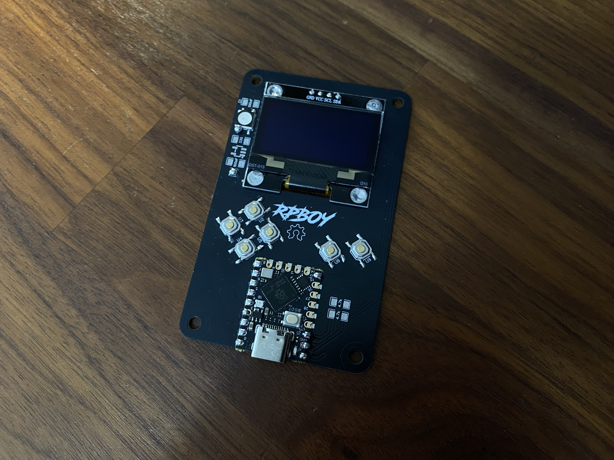
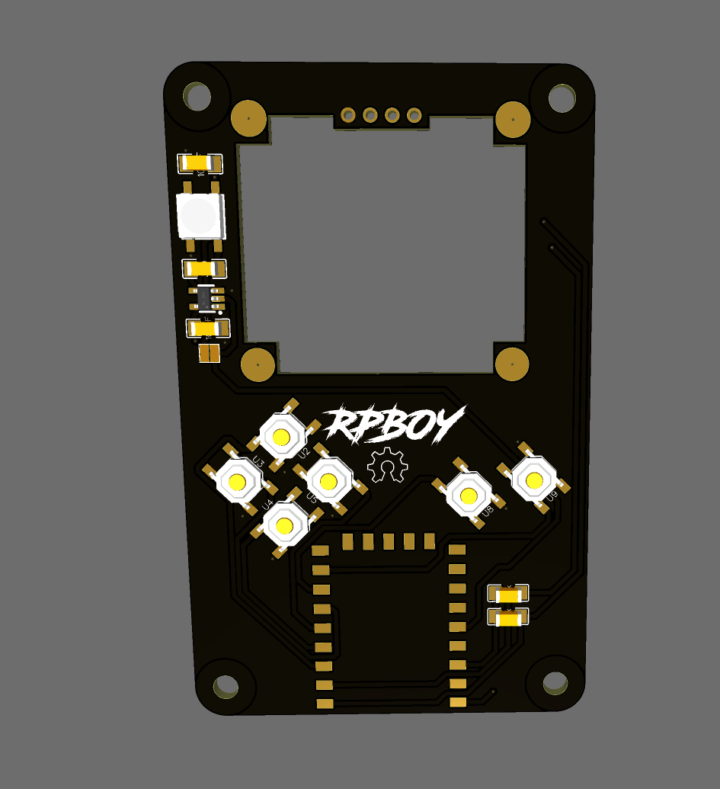

# RPBoy)

---

## Attribution

The following text must be included in any distribution of derivatives of this project. All links must also be included.

Based on the RPBoy by TheTrain.
Originally based on the Arduboy by Kevin Bates.

Copyright © 2026 [TheTrain](http://x.com/thetrain24) 

[Licensed under CC BY 4.0](https://creativecommons.org/licenses/by/4.0/)

Changes from the original design:
  - list any changes you make here

Anyone selling this commercially must include in the listing that this is an open source item, link to the original repo and include the copyright as well as the link to my X account.

## Summary

The RPBoy was designed as an RP2040 based alternative to the Arduboy.  While it can be used to run some Arduboy games with code modification, I am adding it here as it can also run GP2040-CE just fine.  

Please note that none of the converted Arduboy code will be posted here.

I do have plans to make a simple case for this, and may work on the design a bit in the future.  I have no plans to make it powered by battery.

## Board design choices

This is a very simple board.  It has an RP2040 SuperMini, 1.31" OLED and a few tac switches on it.  There is no battery on it and I have no plans to add a battery / charging circuit to it, this will just be for use plugged in.

Parts needed:
- The PCB in this repo
- 1x RP2040 SuperMini (usually gotten from somewhere like AliExpress) [the Waveshare Zero will not work!]
- 1x 1.31" OLED
- 6x SMD-4P,5.1x5.1mm 1.5mm tac switches

Optional parts:
- 1x 1206 100nF cap
- 1x 1206 330 resistor
- 2x 1206 4.7k resistors
- 1x SOT-23-5 3V 300mA 18V linear regulator (C236664 or similar)
- 1x WS2812B normal package RGB LED

Note on parts: The 4.7k resistors are for the OLED but most OLEDs will be fine without them.  The other optional parts are for the RGB LED which you do not need to have unless you want to.  I have also included a bridge area at the bottom of the RGB LED circuit so you can bypass the other parts and just put the RGB LED on.

## How to order a board

All of the boards so far have been ordered though JLCPCB.  Due to minimum order numbers you would get five of these Ghost Auth boards.  Here are the steps to make your first order and what options I choose along the way.

1 - Go to JLCPCB.com 

2 - Click on `Instant Quote` 

3 - Click on `Add Gerber file` and choose the file named `Gerber_RPBoy_v1.0.zip` from the `Hardware files` folder 

4 - Choose the following options for the board: 
- Base Material = FR-4 
- Layers = 2 
- Dimensions = (should auto-populate) 50 mm x 80 mm 
- PCB Qty = (however large your run will be, minimum of 5) 
- Product Type = Industrial/Consumer electronics 
- Different Design = 1 
- Delivery Format = Single PCB 
- PCB Thickness = 1.6 
- PCB Color = (up to you) 
- Silkscreen = (defaults to white for all except white boards which is black) 
- Surface Finish = HASL(with lead) 
- Outer Copper Weight = 1oz 
- Via Covering = Tented 
- Board Outline Tolerance = +/- 0.2mm (Regular) 
- Confirm Production file = No 
- Remove Order Number = Yes 
- Flying Probe Test = Fully Test 
- Gold Fingers = No 
- Castellated Holes = No 
- No advanced options 

6 - Make sure you have read the terms and conditions of JLCPCB assembly service and then click on the `Confirm` button if you agree  

!!!Note - Please note that we are not responsible for boards made by JLCPCB or any other manufacturer that do not work!!!

7 - The `Secure Checkout` process will be different based on your location in the world.  We recommend researching your shipping options to choose the one that is right for your application. 

## Donations

Donations are welcome and will be used to further refine the files, test additional parts and work on other layouts that interest me.

You can donate here: https://www.paypal.com/donate/?hosted_button_id=2JMTZVCGLDYC2

## Revision History

v1.0
- Initial design

## Acknowledgements

- [TheTrain](https://github.com/TheTrainGoes) for the board design
- FeralAI for starting the GP2040 project and the original design of the Pico Fighting Board
- Everyone that works on the GP2040-CE project to make it the best controller firmware around
- Kevin Bates for the [Arduboy](https://www.arduboy.com) 
