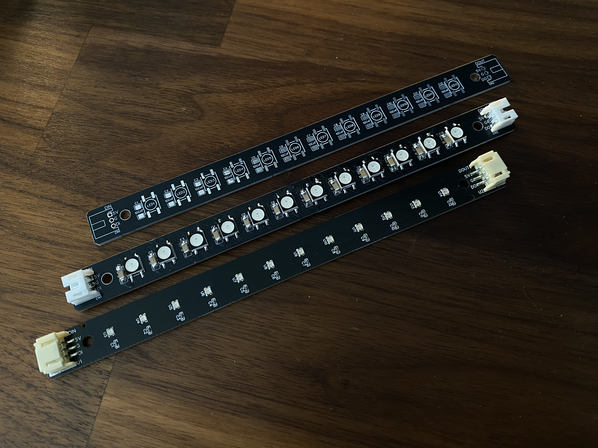
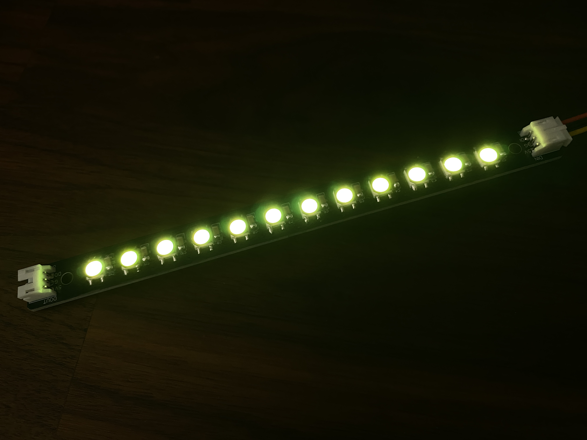
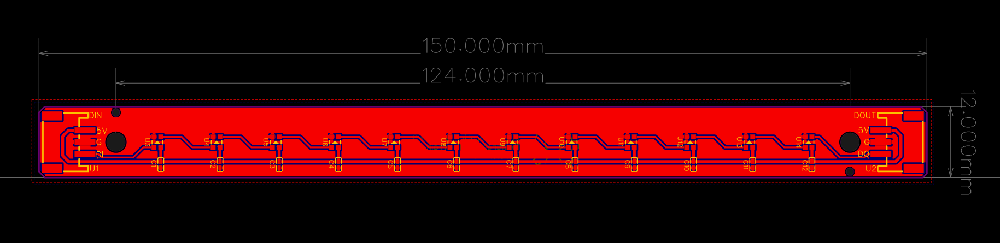

# Open LED Project - Addressable RGB LED Light Bar

---

## Attribution

The following text must be included in any distribution of derivatives of this board. All links must also be included.

Based on the Open LED Project - Addressable RGB LED Light Bar by TheTrain in collaboration with AFS (AllFightSticks).

Copyright © 2025 [TheTrain](https://github.com/TheTrainGoes) 
Copyright © 2025 [AllFightSticks](https://allfightsticks.com/) 

[Licensed under CC BY 4.0](https://creativecommons.org/licenses/by/4.0/)

Changes from the original design:
  - list any changes you make here

Anyone selling this commercially must include in the listing that this is an open source item, link to the original repo and include both copyrights as well as their respective links.

## Summary

The `Open LED Project` aims to offer open source RGB LEDs boards and addons for various devices.

The `Addressable RGB LED Light Bar` come in two versions, an assembly version and also a DIY version.  

Notes:
- The assembly and DIY version have different mounting points (please reference the images for center to center measurements)
- The DIY version has an incorrectly placed connector in the STEP file, it should be centered on the board
- We are not responsible for manufacturing defects
- We are not responsible for any damages cause by this item
- LEDs can use a lot of power when large numbers of them are connected to a single device.  Please be aware of total power draw from the device you have connected to

## Board design choices

These are simple 12 LED strips that can either be used on their own or chained with other units to create case LEDs.  

These do not have to be used with devices running GP2040-CE but have been designed to be used with the case LED feature that was released as part of v0.7.11.

A set of 3.10mm mounting holes can be found on both the assembly and DIY versions of the board that can be used for either standoffs or bolts.  It is recommended to just use double sided adhesive tape (10mm / 1cm width).

## Assembly

There are two versions of the board, an assembly version with smaller LEDs and a DIY version with larger LEDs.  

The DIY version is designed to be hand-soldered.  

I have increased the size of the pads for the WS2812B RGB LEDs on the DIY version so that they are easier to hand solder.   

## There are 27 total parts needed to assemble the DIY version: 

1 x Board 
12 x WS2812B RGB LED 
12 x 100nF cap - 0402 size 
2 x JST 3pin 2.00mm right angle connector 

These parts can be sourced from AliExpress or most part sellers.

## How to order a board

All of the boards so far have been ordered though JLCPCB.  

1 - Go to JLCPCB.com 

2 - Click on `Order Now` 

3 - Click on `Add Gerber file` and choose the file named `Gerber - Addressable RGB LED Light Bar v1.1 - DIY version.zip` or `Gerber - Addressable RGB LED Light Bar v1.1 - Assembly version.zip` from the `Hardware files` folder 

4 - Choose the following options for the board: 
- Base Material = FR-4 
- Layers = 2 
- Dimensions = (should auto-populate) 150 mm x 12 mm 
- PCB Qty = (however large your run will be, minimum of 5) 
- Product Type = Industrial/Consumer electronics 
- Deburring/Edge rounding = Yes 
- Different Design = 1 
- Delivery Format = Single PCB 
- PCB Thickness = 1.6 
- PCB Color = (up to you) 
- Silkscreen = (defaults to white for all except white boards which is black) 
- Surface Finish = HASL(with lead) 
- Outer Copper Weight = 1oz 
- Via Covering = Tented 
- Min via hole size/diameter = 0.3mm 
- Confirm Production file = No for DIY version, Yes for assembly version - Note that this costs money 
- Mark on PCB = Remove Mark 
- Electrical Test = Flying Probe Fully Test 
- Gold Fingers = No 
- Castellated Holes = No 
- Edge Plating = No 
- No advanced options 

If all looks well here you can click on the `SAVE TO CART` button.

If you are just doing the DIY version go to step 5a and stop after.  If you are doing the assembly version go to 5b and continue.

5a - The `Secure Checkout` process will be different based on your location in the world.  We recommend researching your shipping options to choose the one that is right for your application. 

5b - Choose the following options for the PCB assembly
- Enable PCB Assembly 
- PCBA Type = Economic (note 1) 
- Assembly Side = Top Side 
- PCBA Qty = (however large your run will be, minimum of 2) 
- Tooling holes = Added by Customer 
- Confirm Parts Placement = Yes (note 2) 

Note 1 - Economic assembly is much cheaper on smaller batch runs of 10-30 units.  Standard assembly will yield less dead on arrival boards but is more expensive to have done.  On average I expect a 5-10% failure rate on the boards from JLCPCB so please factor that in when making your order.

Note 2 - This adds around $1 to the total cost of the order and is 100% worth doing as they will check the placement of all SMD parts and make any necessary changes or reach out if there are concerns.  I cannot stress enough that this is the best $1 you will spend for the peace of mind of not messing up an entire batch.

6 - Make sure you have read the terms and conditions of JLCPCB assembly service and then click on the `Confirm` button if you agree  

7 - The Bill of Materials page will show you a render of the board without parts.  You can click the `NEXT` button here unless you see any issues with the board 

8 - You will now have the option to upload two files:
- For the `Add BOM File` you will need to choose the `BOM - Addressable RGB LED Light Bar v1.1 - Assembly version.csv` file that is located in the Hardware files folder
- For the `Add CPL File` you will need to choose the `CPL - Addressable RGB LED Light Bar v1.1 - Assembly version.csv` file that is located in the Hardware files folder 
Once these two files have been uploaded you can press the `Process BOM & CPL` button.

9 - You will now see a list of components that will be used to assemble the boards.  If there are not listed issues here you can click on the `NEXT` button. (note 6), (note 7)

Note 6 - You can also use this page to omit parts from the assembly.  It is not recommended to omit any parts.

Note 7 - We have spent extensive time to ensure that the parts chosen will work for this board.  If there are any parts that are out of stock, or you get warnings about anything we would recommend you not proceed unless you understand how to find replacement parts.  If you are unsure, please feel free to join up in the Discord and ask us.  It is not uncommon for JLCPCB to have part shortages.  Most of the parts listed here come back in stock in a few days.  If that is the case, you may need to wait to place your order until all needed parts are in stock.

10 - There will now be a render of the board with parts on the Component Placements page.  Check this page to make sure that all parts are in the correct spots and orientation.  We have ordered based on these files before and they are known good.  If all looks well press the `NEXT` button. (note 8)

Note 8 - Please note that we are not responsible for boards made by JLCPCB or any other manufacturer that do note work.

11 - The quote & order page will give you a breakdown of the costs associated with the boards and assembly parts based on the quantity you have chosen. This does not include shipping.  Shipping will be calculated at a further step. 
- For Product Description I typically choose `Other` `Other` and type in `LED board`.

If all looks well here you can click on the `SAVE TO CART` button.

12 - The `Secure Checkout` process will be different based on your location in the world.  We recommend researching your shipping options to choose the one that is right for your application. 

## Sales recommendations

Through this project's licensing, you are free to make and sell these boards in group buys or even commercial applications.  

There is a recommended MSRP of $10 USD for a single Addressable RGB LED Light Bar, $20 USD for a pair with a lot of 4-6 receiving a discount at $35 USD for 4x and $50 USD for 6x.

A normal AFS case can use anywhere from 2 to 6 of these LED light bars.

You are free to set your own price as you see fit. 

## Donations

Donations are not necessary but always welcome!  All received donations are used for testing, iterations and trying new things.

https://www.paypal.com/donate/?hosted_button_id=2JMTZVCGLDYC2

## Revision History

v1.0
- Initial open source design

## Acknowledgments

- [TheTrain](https://github.com/TheTrainGoes) for doing the board design
- [AllFightSticks](https://allfightsticks.com/) for covering prototyping costs and helping with design specs for the AFS cases