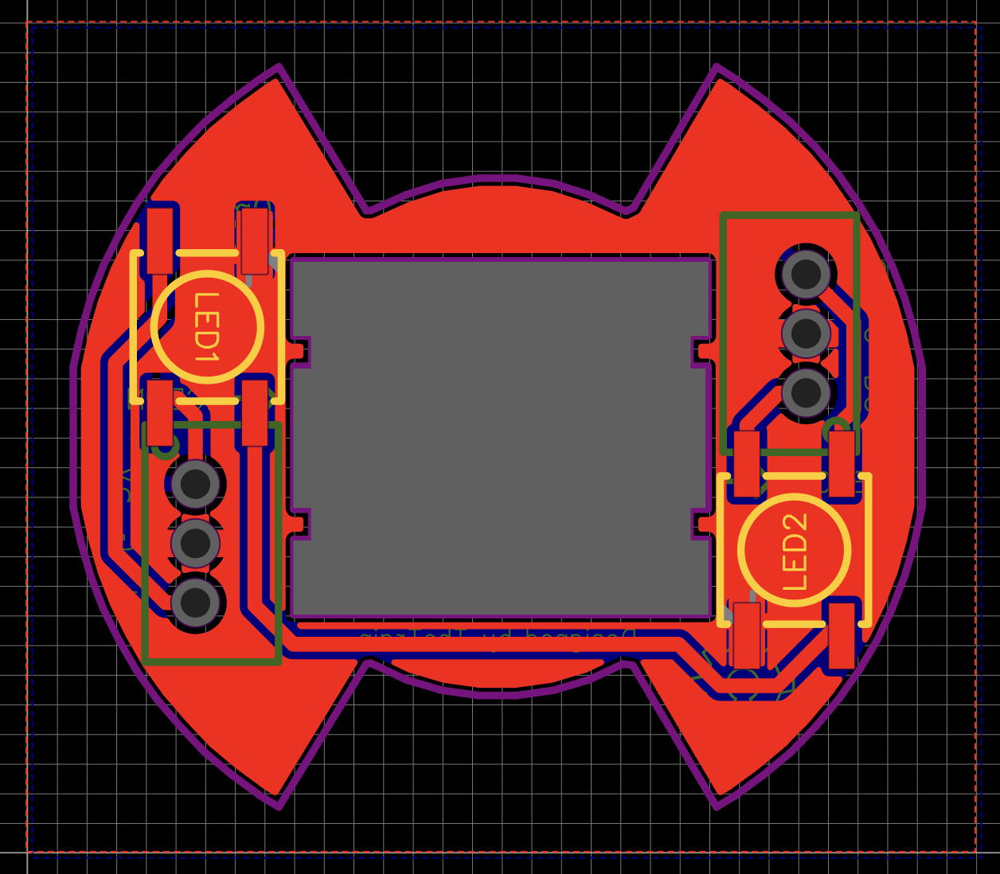
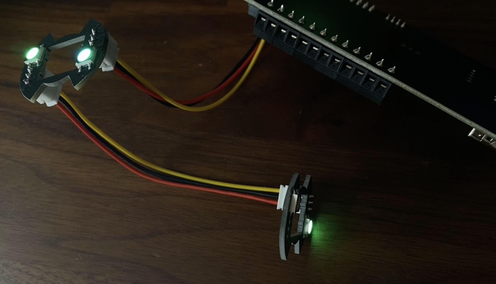

# Open LED Project - Sanwa 30mm RGB LED

---

## Attribution

The following text must be included in any distribution of derivatives of this board. All links must also be included.

Based on the Open LED Project - Sanwa 30mm RGB LED by TheTrain.

Copyright © 2024 [TheTrain](https://github.com/TheTrainGoes)

[Licensed under CC BY 4.0](https://creativecommons.org/licenses/by/4.0/)

Changes from the original design:
  - list any changes you make here

## Summary

The `Open LED Project` aims to offer open source RGB LEDs for various popular buttons.  These will be worked on over time, but there are no guarntees that all buttons will get an RGB LED board.  Please do not ask for specific buttons to be made.

These boards are deisgned to be hand soldered, not assembled.  An assembly version may be made in the future.  Due to the fact that these are double sided assembly costs will be high if those plans are released.

These boards use standard WS2812B (5050) RGB LEDs.

Notes:
- These boards are only compatible with Sanwa 30mm buttons, not 24mm buttons.  
- These boards are only comaptibe with clear Sanwa 30mm buttons
- These boards are only compatible with genuine Sanwa 30mm buttons, they may not fit on clone buttons
- There may be manufacturing variances from JLC between batches due to the small overall size and tight tolerences.  It is recommended to test fit before assembling.

## Board design choices

These boards are designed to snap onto the bottom of a clear Sanwa 30mm button.  They feature two WS2812B (5050) RGB LEDs as well as a data in and data out 3pin 2.00mm connector.  

This connector is pinned in the standard manner used on the RP2040 Advanced Breakout Board and other RP2040 based devices that I have made.  

There is no capacitor for the LEDs but I do not believe it is needed on something small like this given the newer LEDs.

## Assembly

This board is designed to be hand-soldered.  I have increased the size of the pads for the WS2812B RGB LEDs so that they are easier to hand solder.   

## There are 4 total parts needed to assemble each unit: 

2 x WS2812B RGB LED 
2 x JST 3pin 2.00mm vertical connector

These parts can be sourced from AliExpress or most part sellers.

## How to order a board

All of the boards so far have been ordered though JLCPCB.  Due to the small size it is recommened to order these in batches.  

1 - Go to JLCPCB.com 

2 - Click on `Order Now` 

3 - Click on `Add Gerber file` and choose the file named `Gerber - Sanwa 30mm RGB LED v1.0.zip` from the `Hardware files` folder 

4 - Choose the following options for the board: 
- Base Material = FR-4 
- Layers = 2 
- Dimensions = (should auto-populate) 28.63 mm x 24.97 mm 
- PCB Qty = (however large your run will be, minimum of 5) 
- Product Type = Industrial/Consumer electronics 
- Different Design = 1 
- Delivery Format = Single PCB 
- PCB Thickness = 1.6 
- PCB Color = (up to you) 
- Silkscreen = (defaults to white for all except white boards which is black) 
- Surface Finish = HASL(with lead) 
- Outer Copper Weight = 1oz 
- Via Covering = Tented 
- Confirm Production file = No 
- Mark on PCB = Remove Mark 
- Electrical Test = Flying Probe Fully Test 
- Gold Fingers = No 
- Castellated Holes = No 
- Edge Plating = No 
- No advanced options 

If all looks well here you can click on the `SAVE TO CART` button.

5 - The `Secure Checkout` process will be different based on your location in the world.  We recommend researching your shipping options to choose the one that is right for your application. 

## Sales recommendations

Through this project's licensing, you are free to make and sell these boards in group buys or even commercial applications.  

There is a recommended MSRP of $2 USD for a single Sanwa 30mm RGB LED board or $25 USD for a set of 8 boards shipped in the USA and Canada.

You are free to set your own price as you see fit. 

## Donations

Donations are not necessary but always welcome!  All received donations are used for testing, iterations and trying new things.

https://www.paypal.com/donate/?hosted_button_id=2JMTZVCGLDYC2

## Revision History

v1.0
- Initial open source design

## Acknowledgments

- [TheTrain](https://github.com/TheTrainGoes) for doing the board design