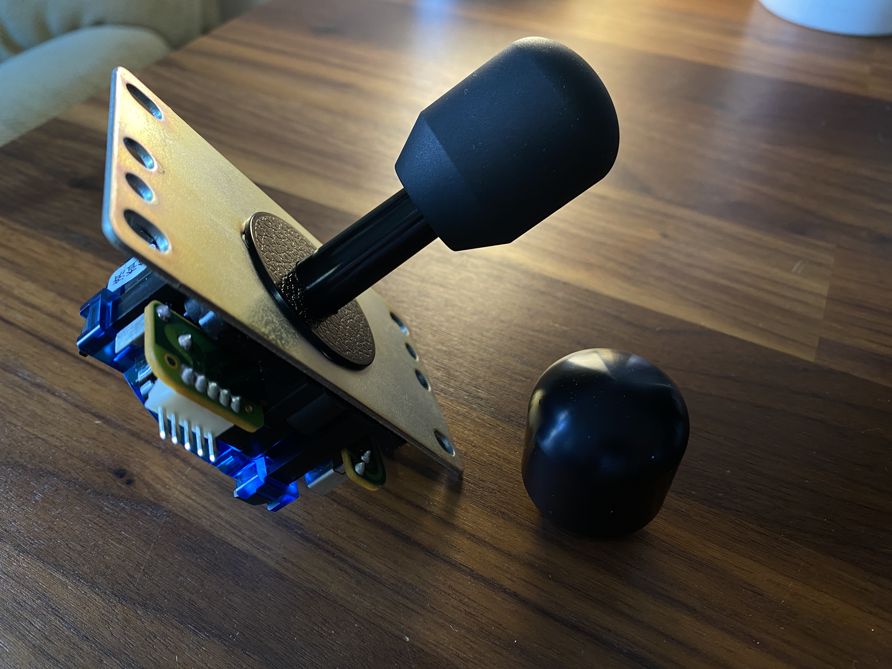

# Sanjuks Style Nobi Topper

---

## Attribution

The following text must be included in any distribution of derivatives of this board. All links must also be included.

Based on the Sanjuks Style Nobi Topper designed by TheTrain.

The Sanjuks Nobi Topper was designed by Bandit (maker and owner of the Sanjuks brand)

Copyright © 2024 [TheTrain](https://github.com/TheTrainGoes)

[Licensed under CC BY 4.0](https://creativecommons.org/licenses/by/4.0/)

Changes from the original design:
  - list any changes you make here

## Summary

This is a Sanjuks style Nobi topper for JLF/JLX type sticks.  This should be compatible with any shafts that support a M6 topper.  This has a 12mm thread length.

It is recommended to have this done in Aluminum and have it both bead blasted and anodized.  I have not tested other materials or finishes.

## How to order one

All of the boards so far have been ordered though JLCPCB.  Due to minimum order numbers you would need to get at least five of these basic breakout boards.  Here are the steps to make your first order and the options I chose along the way.

1 - Go to JLCPCB.com 

2 - Click on `Order Now` 

3 - Click on `3D Printing/CNC` 

4 - Click on `CNC Machining` 

5 - Click on `Upload 3D models` and choose the file named `Sanjuks Style Nobi Topper.step` from the `Hardware files` folder 

6 - Choose the following options for the board: 
- Material = Aluminum 
- Type of Aluminum = Aluminum 7075 (Note 1) 
- Surface Finish = Add -> Bead blasting + Add -> Anodizing -> Black -> Matte 
- Tightest Tolerance = ISO 2768 medium 
- Smallest Roughness = Ra3.2 
- Threads = Yes 

A new box will pop up and ask you to upload a PDF, DWG, DXF, JPG or PNG.  Upload the `Sanjuks Style Nobi Topper - Tap file.dxf` file from the `Hardware files` folder 

- Sub-assembly = No 
- Product Desc = Choose what you think fits best. 

On the right hand side you will see a `Build time` selection.  It should default to `Standard: 7 days`.  You can save a few bucks by moving that to `Economic: 12 days`. 

Note 1 - There is a small difference in price between Aluminum 6061 and 7075, please choose what is best for you - there is mo major benifit to either of these for this model.

If all looks well here you can check off `I agree to JLCCNC's terms of use` and then click on the `Submit Order` button.

You will be taken to the shipping and shipping method page.  This will change based on where you are located.

## Sales recommendations

Through this project's licensing, you are free to make and sell these toppers in group buys or even commercial applications.  

There is a recommended MSRP of $35 USD for the Sanjuks Style Nobi Topper including shipping within the USA or Canada.

You are free to set your own price as you see fit. 

## Donations

Donations are not necessary but always welcome!  All donations recieved go towards making more cool stuff.

https://www.paypal.com/donate/?hosted_button_id=2JMTZVCGLDYC2

## Revision History

v1.0
- Initial open source design

## Acknowledgments

- [TheTrain](https://github.com/TheTrainGoes) for designing the Sanjuks Style Nobi Topper.
