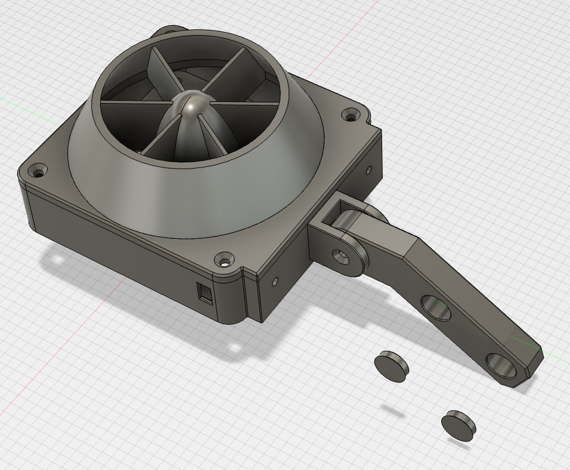

# Wind Sim

---

## Attribution

The following text must be included in any distribution of derivatives of these models, the custom board or the code for it. All links must also be included.

Based on the Wind Sim project by TheTrain

Copyright © 2025 [TheTrain](https://x.com/thetrain24)

[Licensed under CC BY 4.0](https://creativecommons.org/licenses/by/4.0/)

Changes from the original design:
  - list any changes you make here

## Summary

This is a Wind Sim project I made for racing sim.  

I play on an Xbox Series X and mainly play Forza Motorsport (2023).  Outside of using a program like SimHub there are not many options for telemetry based accessories available for the Xbox.

Found here are just the 3D print files, coming soon will be the custom code for the Pico W that will allow you to connect to Forza Motorsport (2023) and have the fans spin in accordance to the car speed.

While some inspiration was taken from various paid models that I saw online, all measurements were taken by myself and the 3D models created from scratch in Fusion360.

A full set of printing STLs, a 3MF as well as source STEP files are provided with this.

This project was done around the Noctua NF-P12 Redux-1700 PWM fan (https://noctua.at/en/nf-p12-redux-1700-pwm).

!!! This may not work with other fans, proceed at your own risk !!!

## Assembly

To assemble the wind sim with a Noctua NF-P12 you will need the following:
- 10x M4 8mm hex countersunk bolt (https://www.aliexpress.com/item/1005006180128211.html)
- 5x M4 16mm  hex standoff (https://www.aliexpress.com/item/1005001949674343.html)
- 1x M4 flange nut (https://www.aliexpress.com/item/1005007116613552.html)

You will also need something to mount this to your rig.  My rig is 4080 aluminum profile so I add the following for each wind sim unit:
- 2x M6 flat head hex bolts
- 2x M6 aluminum profile slot-in holders

Assembly is straight forward, you can choose which mounting point on the bottom to use based on your sim rig setup.

## Printing tips

Print with 6x walls to ensure solid sides, make the layers as thin as possible so you can have a nice print.

I printed this originally on my Bambu X1C with matte black PLA.

You will need the following parts to make one wind sim unit:
- 1x Wind Sim - Fan Reducer
- 1x Wind Sim - Fan Reducer Bracket
- 1x Wind Sim - Main Housing
- 1x Wind Sim - Swivel Adapter
- 1x Wind Sim - Profile Mount

You can also print out some plugs to cover the main rig mounting holes.

## Donations

Donations are not necessary but always welcome!  All received donations will be used for further prototyping.

https://www.paypal.com/donate/?hosted_button_id=2JMTZVCGLDYC2

## Revision History

v1.0
- Initial open source design

## Acknowledgments

- [TheTrain](https://x.com/thetrain24) for doing the original design