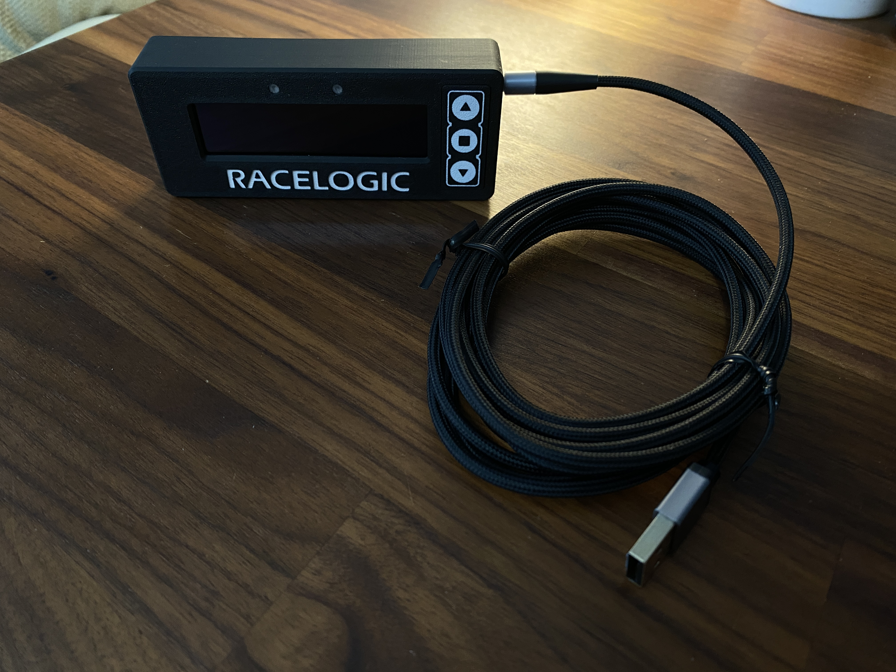
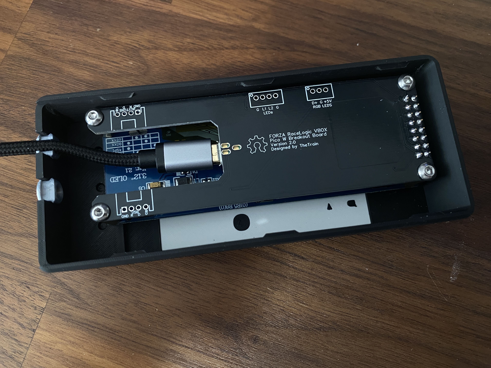

# Forza Laptimer

---

## Attribution

The following text must be included in any distribution of derivatives of these models, the custom board or the code for it. All links must also be included.

Based on the Forza Laptimer project by TheTrain

Copyright © 2025 [TheTrain](https://x.com/thetrain24)

[Licensed under CC BY 4.0](https://creativecommons.org/licenses/by/4.0/)

Changes from the original design:
  - list any changes you make here

## Summary

This is a Laptimer I made for sim racing in Forza on my Xbox.  

I play on an Xbox Series X and mainly play Forza Motorsport (2023).  Outside of using a program like SimHub there are not many options for telemetry based accessories available for the Xbox.

Found here are just the 3D print files and the code for a Pico W that will allow you to connect to Forza Motorsport (2023) and have the lap timer run.

While inspiration was taken from the RaceLogic VBOX Laptimer, all measurements were taken by myself and the 3D models created from scratch in Fusion360.

A full set of printing STLs, a 3MF as well as source STEP file are provided with this.

!!! This may not work with other games, proceed at your own risk !!!

!!!!!!!!!!!!!!!!!!!!!!!!!!!!!!!!!!!!!!!!!!!!!!!!!!!!!!!!!!!!!!!!!!!!!!!!!!!!!!!!!!!!!!!!!!!!!!!!!!!!!!!!!!!!!!!!!!!!!!
!!! Note about the RaceLogic name, trademark and the VBOX Laptimer                                                 !!!
!!!!!!!!!!!!!!!!!!!!!!!!!!!!!!!!!!!!!!!!!!!!!!!!!!!!!!!!!!!!!!!!!!!!!!!!!!!!!!!!!!!!!!!!!!!!!!!!!!!!!!!!!!!!!!!!!!!!!!
!!! Racelogic has approved the release of this model so long as identifying parts of the VBOX Laptimer are removed !!!
!!! Under no circumstances will I release the model files containing the RaceLogic logo, please do not ask         !!!
!!!!!!!!!!!!!!!!!!!!!!!!!!!!!!!!!!!!!!!!!!!!!!!!!!!!!!!!!!!!!!!!!!!!!!!!!!!!!!!!!!!!!!!!!!!!!!!!!!!!!!!!!!!!!!!!!!!!!!

## Code

You will find an Arduino sketch that can be loaded onto your Pico W in the Arduino folder [HERE](Arduino%20Sketch/Xbox_Laptimer.ino).

You will need to make some changes to the sketch based on your network. 

I have tried to make as many notes in it as I can but please note that I am unable to help with code related issues on this.

## Assembly

To assemble the full Laptimer you will need the following:
- 4x M3 11mm hex standoff with 4mm thread (https://www.aliexpress.com/item/1005005462128073.html)
- 4x M3 5mm button top hex bolt (https://www.aliexpress.com/item/32810852732.html)
- 1x Pico W
- 1x 3.12" 256x64 OLED (https://www.aliexpress.com/item/1005006161591545.html)
- 1x Custom PCB
- 1x 2x8p Female header socket (https://www.aliexpress.com/item/1005006134839138.html)

You will also need something to mount this to your rig.  My rig is 4080 aluminum profile so I add the following for each wind sim unit:
- 2x M6 flat head hex bolts
- 1x M4 flange nut
- 1x M4 bolt

## Printing tips

Print with 6x walls to ensure solid sides, make the layers as thin as possible so you can have a nice print.

I printed this originally on my Bambu X1C with matte black PLA.

You will need the following parts to make one Laptimer unit:
- 1x Laptimer - Main housing
- 1x Laptimer - Back cover
- 1x Laptimer - Data insert
- 1x Laptimer - Power insert
- 1x Laptimer - Power insert connector

## Donations

Donations are not necessary but always welcome!  All received donations will be used for further prototyping.

https://www.paypal.com/donate/?hosted_button_id=2JMTZVCGLDYC2

## Revision History

v1.0
- Initial open source design

## Acknowledgments

- [TheTrain](https://x.com/thetrain24) for doing the original design