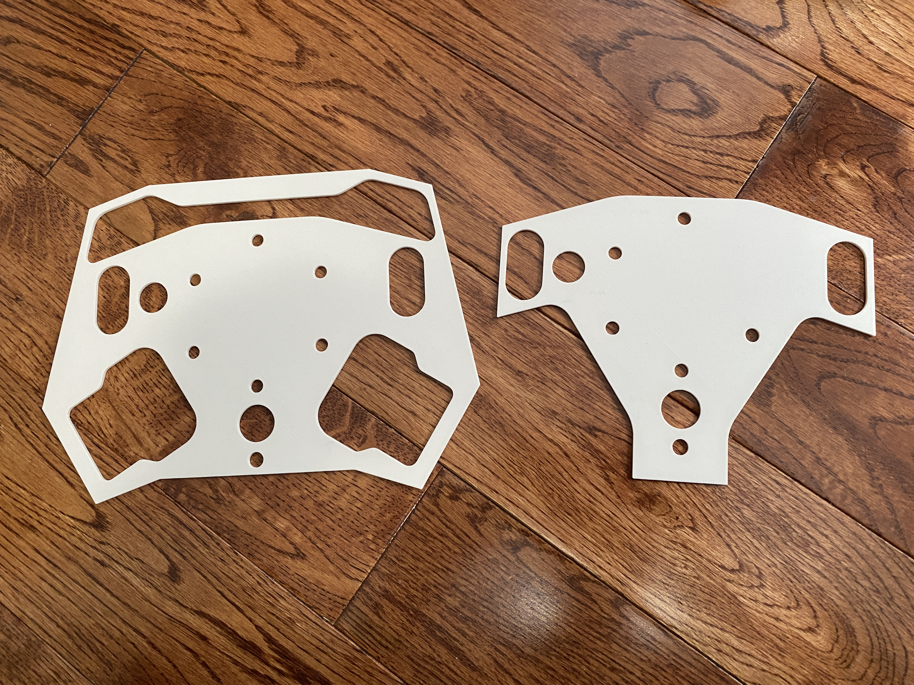
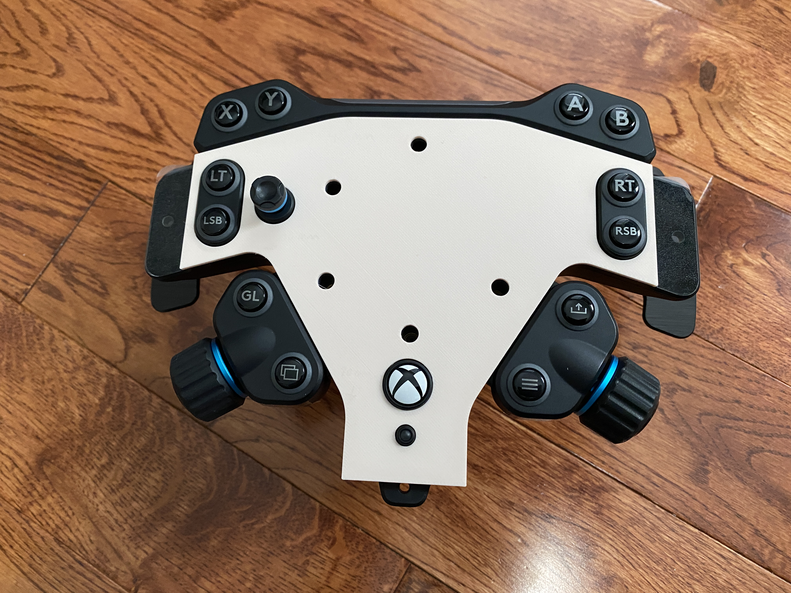
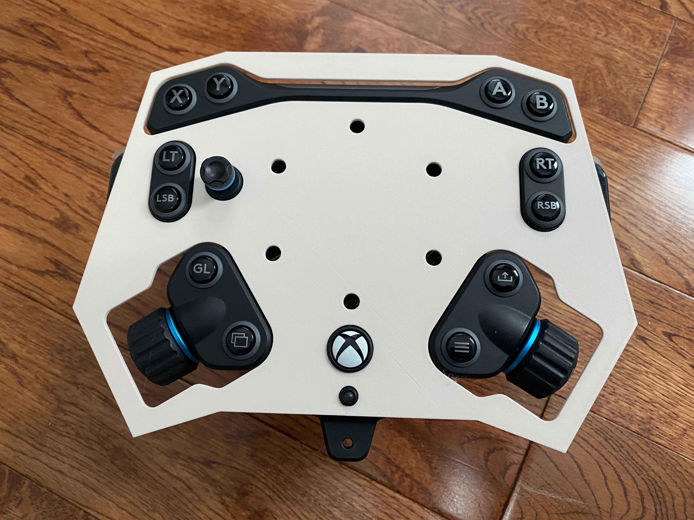

# Logitech G PRO RS Wheel Rim template

---

## Attribution

The following text must be included in any distribution of derivatives of these models, the custom board or the code for it. All links must also be included.

Based on the Logitech G PRO RS Wheel Rim template project by TheTrain

Copyright © 2025 [TheTrain](https://x.com/thetrain24)

[Licensed under CC BY 4.0](https://creativecommons.org/licenses/by/4.0/)

Changes from the original design:
  - list any changes you make here

## Summary

The Logitech G PRO RS Wheel Rim template project is designed to offer an open source template for makers to encourage more wheel rims into the market that are compatible with the Logitech G PRO RS Wheel Hub.

The `Logitech G PRO RS Wheel Rim template` files were measured manually against my Logitech RS Round Wheel and verified to fit my Logitech G PRO RS Wheel Hub (Xbox version).

The `Logitech G PRO RS Wheel Rim template - Full` adds to the above template and has cut out sections for the top LED bar and buttons as well as the left and right rotary encoders.  It has also been verified to fit my Logitech G PRO RS Wheel Hub (Xbox version).

!!! Please note that I have yet to get either of these files cut on metal.  Proceed with caution!  I am not responcible for cuts that do not fit !!!

## What is included?

There are several types of files included in the various folders.

[Logitech G PRO RS Wheel Rim template.stl](/3D%20Print%20Files/Logitech%20G%20PRO%20RS%20Wheel%20Rim%20template.stl) - STL for 3D printing (set at 3mm height to match the Logitech RS Round Wheel) 
[Logitech G PRO RS Wheel Rim template.3mf](/3D%20Print%20Files/Logitech%20G%20PRO%20RS%20Wheel%20Rim%20template.3mf) - 3MF for 3D printing (set at 3mm height to match the Logitech RS Round Wheel) 
[Logitech G PRO RS Wheel Rim template.step](/Source%20files/Logitech%20G%20PRO%20RS%20Wheel%20Rim%20template.step) - STEP file for further modeling (set at 3mm height to match the Logitech RS Round Wheel) 
[Logitech G PRO RS Wheel Rim template.dxf](/DXF%20files/Logitech%20G%20PRO%20RS%20Wheel%20Rim%20template.dxf) - DXF file, commonly used for cutting and CNC (please note that the bolts are not countersunk) 
[Logitech G PRO RS Wheel Rim template - Full.stl](/3D%20Print%20Files/Logitech%20G%20PRO%20RS%20Wheel%20Rim%20template%20-%20Full.stl) - STL for 3D printing (set at 3mm height to match the Logitech RS Round Wheel) 
[Logitech G PRO RS Wheel Rim template - Full.3mf](/3D%20Print%20Files/Logitech%20G%20PRO%20RS%20Wheel%20Rim%20template%20-%20Full.3mf) - 3MF for 3D printing (set at 3mm height to match the Logitech RS Round Wheel) 
[Logitech G PRO RS Wheel Rim template - Full.step](/Source%20files/Logitech%20G%20PRO%20RS%20Wheel%20Rim%20template%20-%20Full.step) - STEP file for further modeling (set at 3mm height to match the Logitech RS Round Wheel) 
[Logitech G PRO RS Wheel Rim template - Full.dxf](/DXF%20files/Logitech%20G%20PRO%20RS%20Wheel%20Rim%20template%20-%20Full.dxf) - DXF file, commonly used for cutting and CNC (please note that the bolts are not countersunk) 

## Donations

Donations are not necessary but always welcome!  All received donations will be used for further prototyping.

https://www.paypal.com/donate/?hosted_button_id=2JMTZVCGLDYC2

## Revision History

v1.0
- Initial open source design

## Acknowledgments

- [TheTrain](https://x.com/thetrain24) for doing the original design