# Logitech RS Wheel Hub Shifter Pad Mod

---
## Summary

This is an install tutorial for shifter pads to be used in the Logitech RS Wheel Hub.  

They will do a few different things:
1 - Make the shifter paddles less noisy
2 - Make the shifts a little softer
3 - Reduce the total amount of movement needed to actuate a shift

** Note 1: I am not responsible for any damage that happen to yourself or any of your equipment as a result of attempting this guide. **  
** Note 2: You can only use 1mm foam for this mod, using anything thicker will result in inconsistent shifts or shifts that do not register at all. **  
** Note 3: I am not responsible if this voids your warranty with Logitech or the retailer you purchased this from. **  

You can find an .SVG cut file in the Source Files folder [HERE](Source%20Files/Logitech%20RS%20Wheel%20Hub%20Shifter%20Pad%20Mod.svg).

This can be loaded into the plot cutter of your choosing, or you can simply print it out at 100% and use it as a template to cut your own.

It is recommended that you use 1mm thick adhesive foam for this.  Using anything thicker may result in inconsistent shifts or shifts that do not register at all.

If you would like to see how this sounds before and after, check out the following videos:

[Logitech RS Wheel Hub Shifter Pad Mod - Before](Assets/RS_Hub_Before.MOV)  
[Logitech RS Wheel Hub Shifter Pad Mod - After](Assets/RS_Hub_After.MOV)  

The foam I used for this mod was purchased from Amazon.  It can be found here:
[1mm Thich Self-Adhesive Foam Sheet](https://www.amazon.ca/gp/product/B07T5L7756/)  

---
## Logitech RS Wheel Hub Disassembly, Foam Install and Re-assembly

You will need a variety of tools for this disassembly. 

Step 1:

Take out the 10 screws located around the exterior of the RS Wheel Hub and the 4 screws that hold on the left and right shifting paddles.

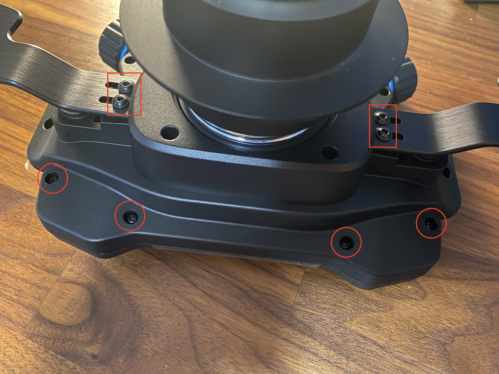
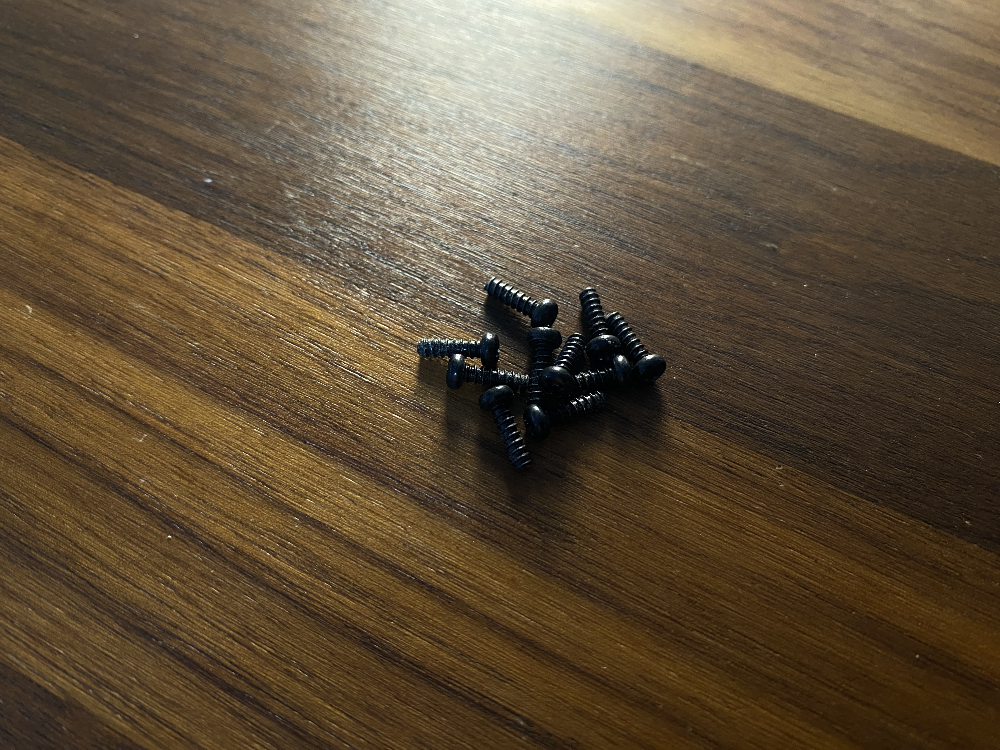

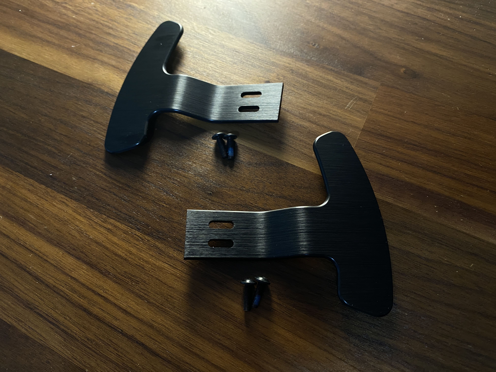

---

Step 2:

If you are using a brand new Hub take off the two stickers from the bottom left and right.

---

Step 3:

Gently pry the two half parts apart.  You can do this with your hands, no tools should be used to remove the half parts.  Be careful not to pull too hard as there is a small connector between the two parts.

Once you have the two half parts separated gently disconnect the connector from the main board on the front half of the Hub.

Although the front havf of the Hub looks cool we will not be making any changes to it so please put it off to the side for now.

---

Step 4:

Using some hex keys, remove the 6 bolts holding on the quick disconnect assembly.

You will notice that one of the bolts is longer than the other ones.

** Note 4: It is recommened to apply some pressure to the back of the quick disconnect assembly while you do this as it will be under spring pressure.  Not doing this could result in damage or injury. **  
** Note 5: I am not responsible for any damage or injury that results from the attempted disassembly and reassembly of this Hub. **  

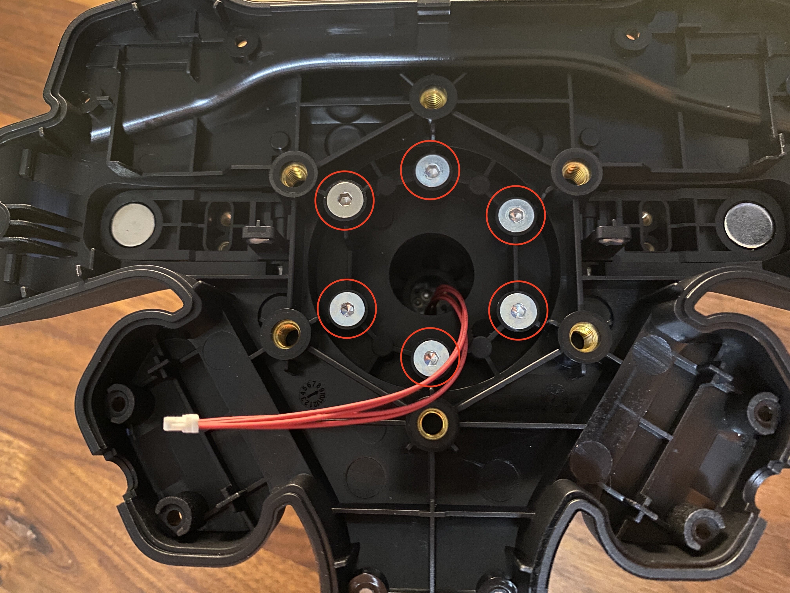

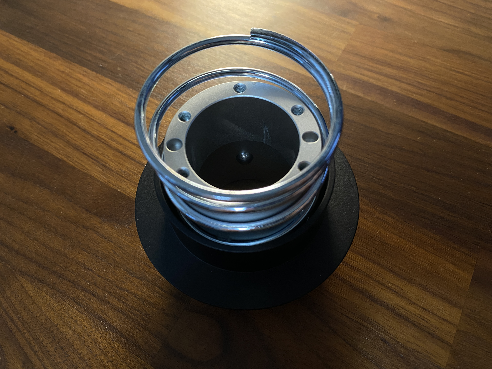

---

Step 5:

Take off the back collar which is attached with four screws.

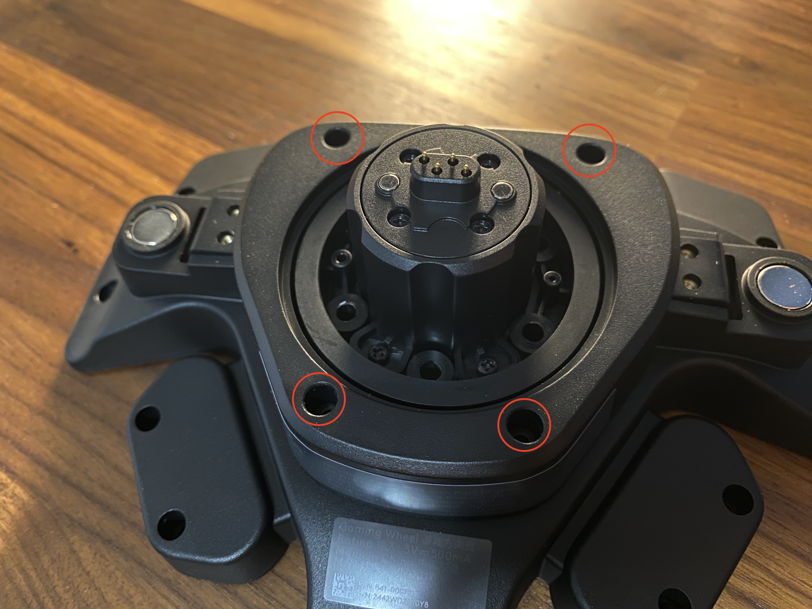
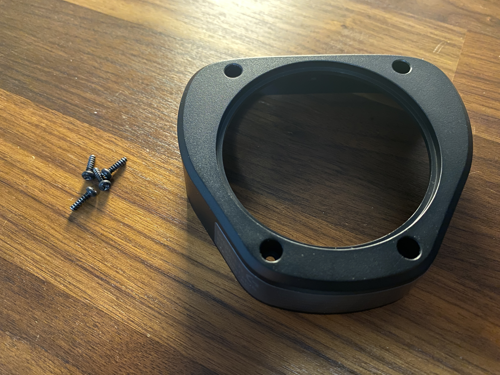

---

Step 6:

Remove the 2 screws that are holding in the paddel shifter retaining bars.

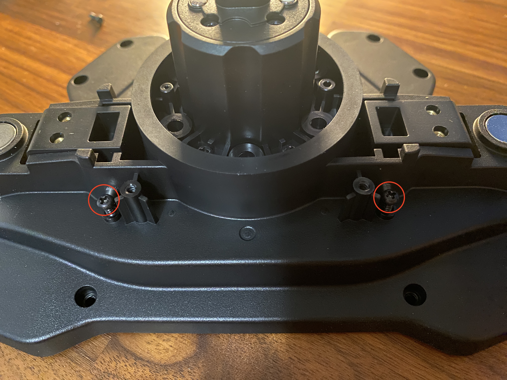
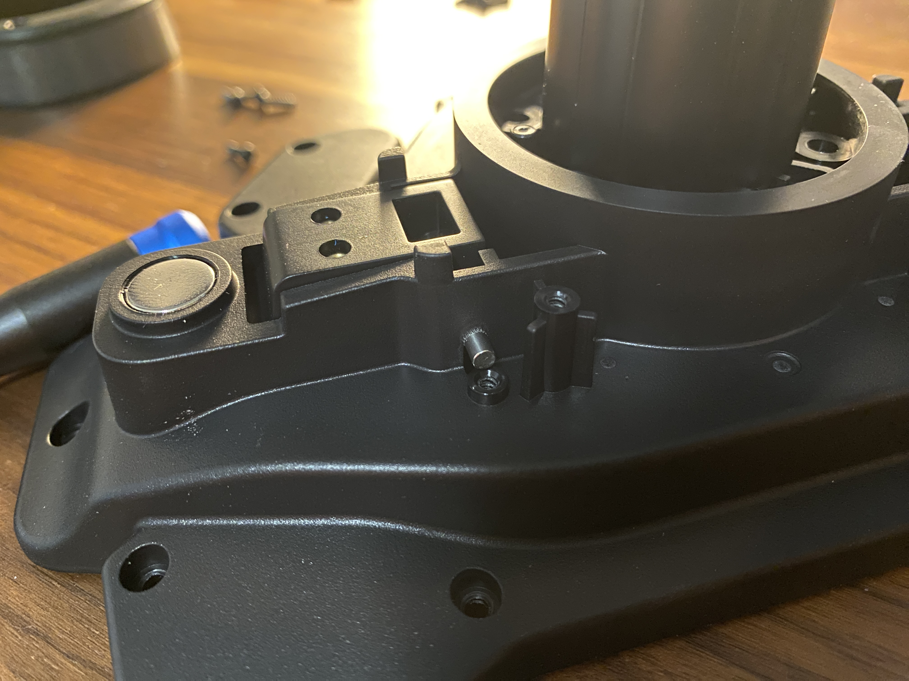

---

Step 7:

Slide out the left and right paddel shifter retaining bars.  

These must be slide out from the bottom side.  The bottom side is the opposite side from the screws you removed in Step 6 above.

N** Note 6: It is recommended to use a long and skinny screwdriver to push the left and right paddel shifter retaining bars out. **  

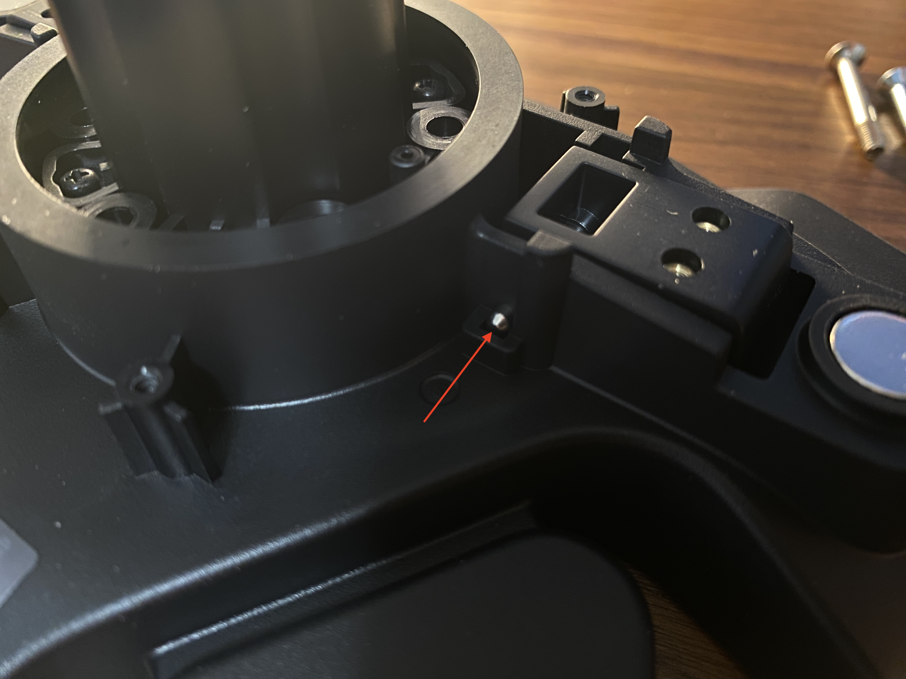
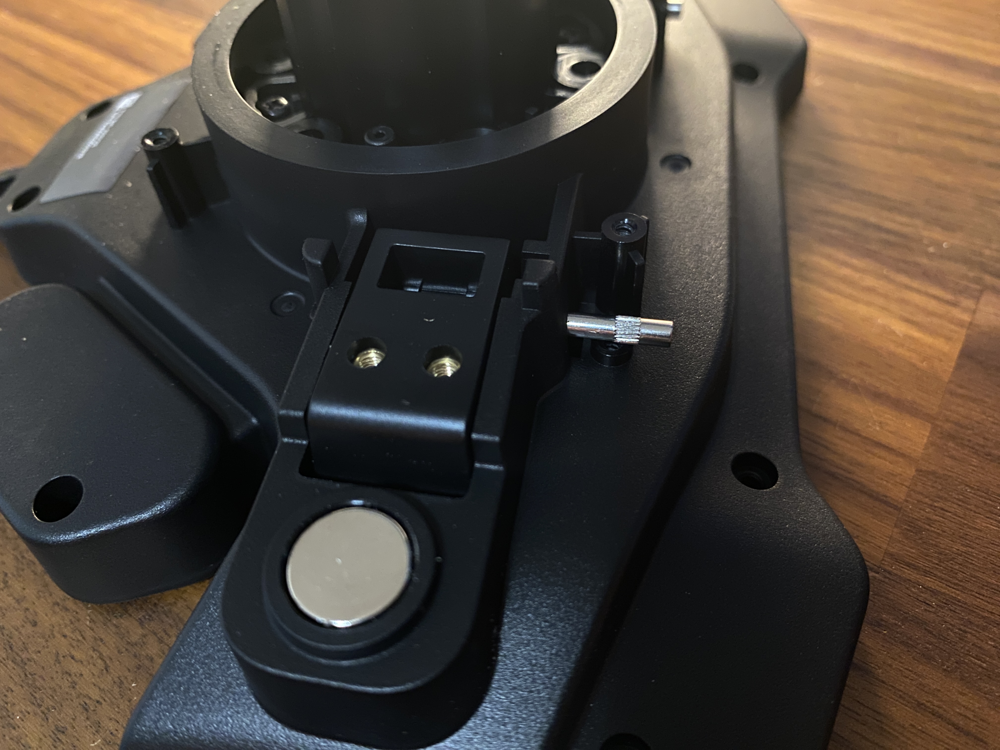
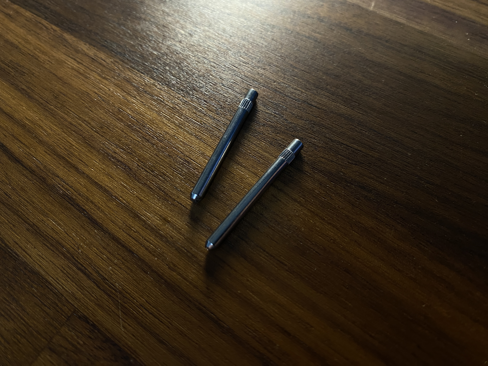

---

Step 8:

Now that the left and right paddel shifter retaining bars have been taken our you can remove the left and right shifter modules.

Once those modules are out take your 1mm foam pads and install them overtop of the existing stickers.

** Note 7: It is not recommended to remove the factory stickers. **  

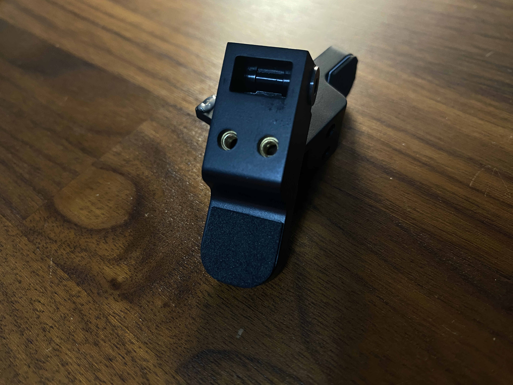

---

Step 9:

Follow the previous steps backwards to start putting the Hub back together.

When you get back to Step 4 it is recommended to compress the spring down on a flat surface and then install the top and bottom bolt securely before you put the others in.

** Note 8: I am not responsible for any damage or injury that results from the attempted disassembly and reassembly of this Hub. **  

---

Congratulations!  

You have successfully modded your Logitech RS Wheel Hub!

Go play some games!!!

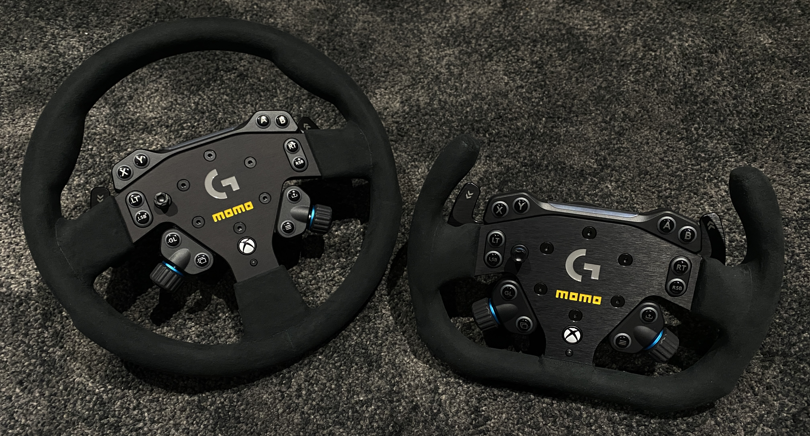