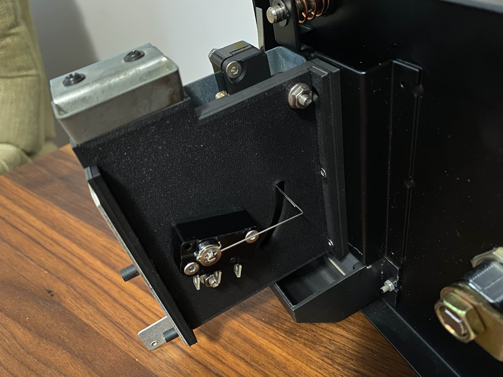
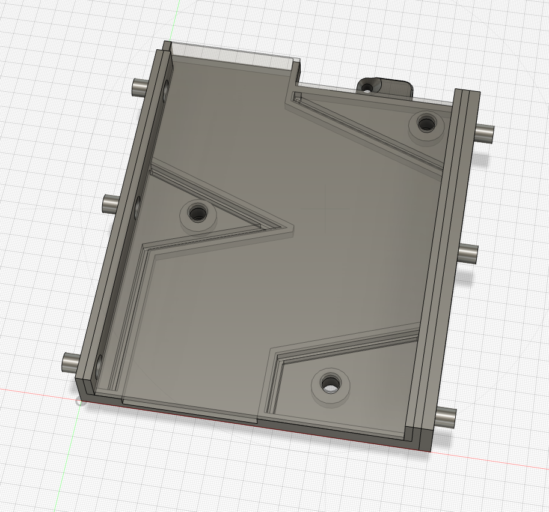
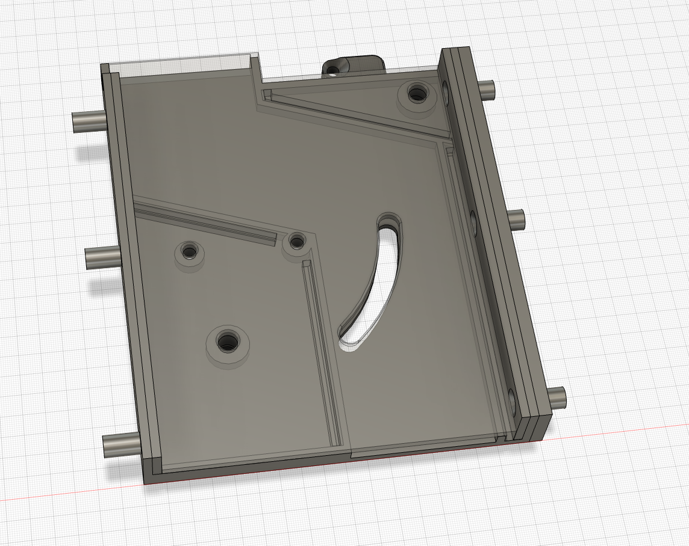

# Vewlix Coin Mech

---

## Attribution

The following text must be included in any distribution of derivatives of this board. All links must also be included.

Based on the Vewlix Coin Mech by TheTrain

Copyright © 2024 [TheTrain](https://github.com/TheTrainGoes)

[Licensed under CC BY 4.0](https://creativecommons.org/licenses/by/4.0/)

Changes from the original design:
  - list any changes you make here

## Summary

This is a replacement coin mech for use in Vewlix and Chewlix units.  I designed this because I wanted a more simple coin mech that would take whatever type of token or coin I put in the unit.  

There are two versions of the model presented here:
1 - `Vewlix Coin Mech - Coin Box Version` - This Version simply replaces the coin mech, coins put through will go into the bottom coin box
2 - `Vewlix Coin Mech - Coin Return Version` - This version will route the coin to the coin return slot, good if you want to reuse coins or not have them go into the bottom coin box

A full set of printing STLs as well as source STEP files are provided with this.

To assemble the `Vewlix Coin Mech - Coin Box Version` you will need:
- 1x Long wire microswitch
- 4-6x M3 14-16mm countersunk hex bolts
- 2x M4 25mm button-top hex bolt
- 2x M4 flange nut
- 2x M3 18mm countersunk hex bolt (or a 25mm bolt will do)
- OPTIONAL 1x M4 18mm button-top hex bolt (or a 25mm bolt will do)
- OPTIONAL 1x M4 flange nut

To assemble the `Vewlix Coin Mech - Coin Return Version` you will need:
- 1x Long wire microswitch
- 4-6x M3 14-16mm countersunk hex bolts
- 2x M4 18mm button-top hex bolt
- 2x M4 flange nut
- 2x M3 25mm countersunk hex bolt (or a 25mm bolt will do)
- 2x M3 flange nut

## Printing tips

Print multiple outside walls as well as multiple top and bottom layers so that this prints at 100% infill.  It is a very small part but prints quickly and will be strong.  

I printed this originally on my Bambu X1C with matte black PLA.

## Donations

Donations are not necessary but always welcome!  All received donations will be used for further prototyping.

https://www.paypal.com/donate/?hosted_button_id=2JMTZVCGLDYC2

## Revision History

v1.0
- Initial open source design

## Acknowledgments

- [TheTrain](https://github.com/TheTrainGoes) for doing the original design
