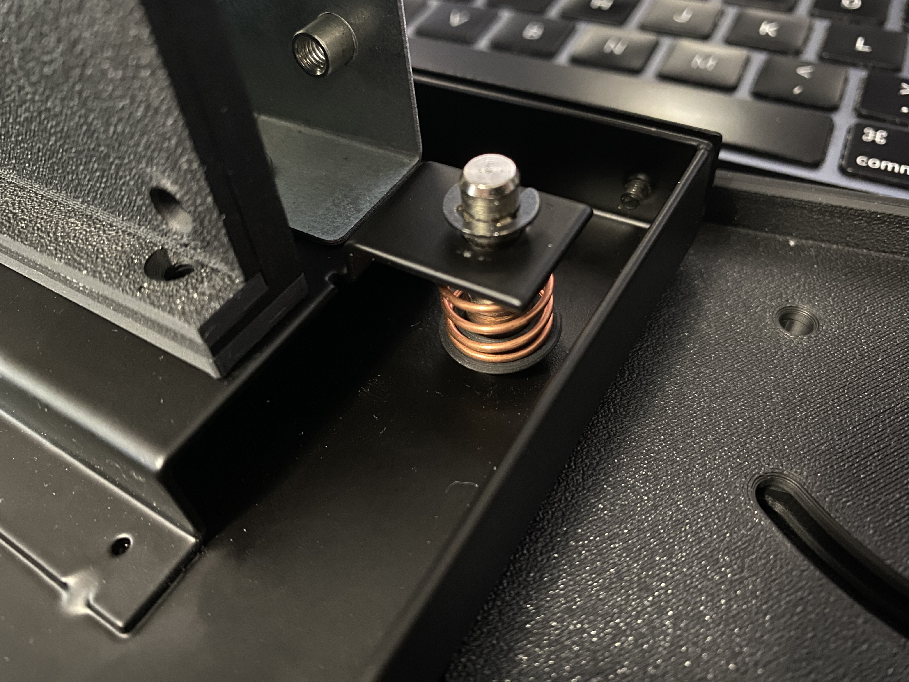
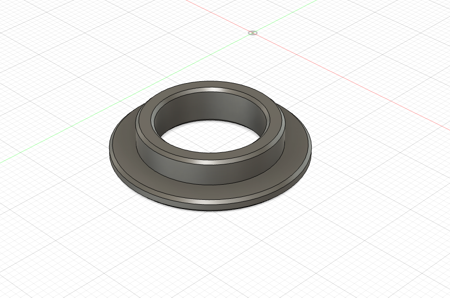

# Vewlix Coin Return Adapter

---

## Attribution

The following text must be included in any distribution of derivatives of this board. All links must also be included.

Based on the Vewlix Coin Return Adapter by TheTrain

Copyright © 2024 [TheTrain](https://github.com/TheTrainGoes)

[Licensed under CC BY 4.0](https://creativecommons.org/licenses/by/4.0/)

Changes from the original design:
  - list any changes you make here

## Summary

This is a very simple mod for your Vewlix / Chewlix unit.  My Chewlix (and others that I have seen) do not come with a spring for the coin return button.  While some of the coin units have a built in return mech that will allow the button to work, if you are making a custom solution this will just float.

The Vewlix coin return adapter lets you put a standard JLF spring (or JLF type spring) in to allow the coin return button to spring return.  

## Printing tips

Print multiple outside walls as well as multiple top and bottom layers so that this prints at 100% infill.  It is a very small part but prints quickly and will be strong.  

I printed this originally on my Bambu X1C with matte black PLA.

## Donations

Donations are not necessary but always welcome!  All received donations will be used for further prototyping.

https://www.paypal.com/donate/?hosted_button_id=2JMTZVCGLDYC2

## Revision History

v1.0
- Initial open source design

## Acknowledgments

- [TheTrain](https://github.com/TheTrainGoes) for doing the original design
