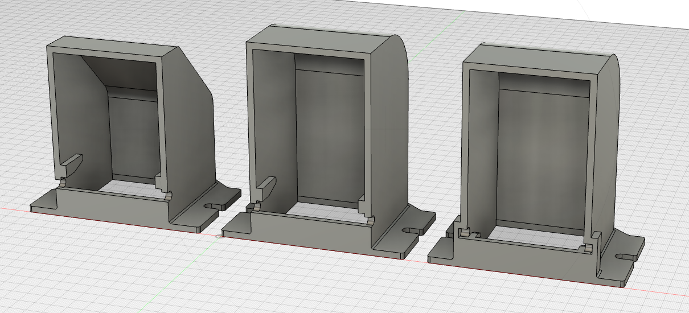

# Vewlix Coin Return Slot

---

## Attribution

The following text must be included in any distribution of derivatives of this board. All links must also be included.

Based on the Vewlix Coin Return Slot by TheTrain

Copyright © 2024 [TheTrain](https://github.com/TheTrainGoes)

[Licensed under CC BY 4.0](https://creativecommons.org/licenses/by/4.0/)

Changes from the original design:
  - list any changes you make here

## Summary

This is a collection of different Vewlix / Chewlix Coin Return Slots.  

There are three different versions included here: 
1 - `Vewlix Coin Return Slot - Original` - Copy of hte original design. 
2 - `Vewlix Coin Return Slot - Extended` - Extended version of the original with a sloped back, good if you want to have a bunch of coins in there at any given moment. 
3 - `Vewlix Coin Return Slot - Push in flap` - Extended and has a push in flap so coins are easier to get. The flap on this one will not swing forward like in the others. 

## Printing tips

Print multiple outside walls as well as multiple top and bottom layers so that this prints at 100% infill.  It is a very small part but prints quickly and will be strong.  

I printed this originally on my Bambu X1C with matte black PLA.

I have also had this done from JLCPCB in their `Imagine Black` resin and it turned out very well.

## Donations

Donations are not necessary but always welcome!  All received donations will be used for further prototyping.

https://www.paypal.com/donate/?hosted_button_id=2JMTZVCGLDYC2

## Revision History

v1.0
- Initial open source design

## Acknowledgments

- [TheTrain](https://github.com/TheTrainGoes) for doing the original design
