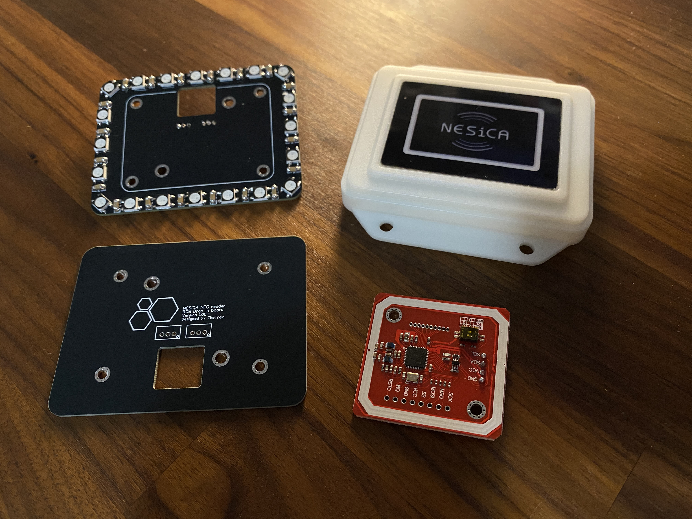

# Vewlix NESiCA NFC Reader


---

## Attribution

The following text must be included in any distribution of derivatives of this board. All links must also be included.

Based on the Vewlix Control Panel SiTong Adapter Rings by TheTrain

Copyright © 2025 [TheTrain](https://github.com/TheTrainGoes)

Special thanks to:
    [Lucipher](https://github.com/arntsonl)
    [NickGuyver](https://github.com/NickGuyver)
    [Wizzomafizzo](https://github.com/wizzomafizzo)

[Licensed under CC BY 4.0](https://creativecommons.org/licenses/by/4.0/)

Changes from the original design:
  - list any changes you make here


## Summary

!!!PLEASE NOTE THAT THIS WILL NOT WORK WITH BROOK BOARDS!!!

The Vewlix NESiCA NFC Reader allows you to add a PN532 NFC module to your RP2040 based control panel setup.  This updated version also loads information from a Micro SD card to make adding things easier.

The reason I made this was to allow me to launch Nintendo Switch games at the tap of a card and not have to navigate to them manually.  It also allows me to hide buttons like `Home`, `Capture` and `- (select / insert coin)` from the main control panel.

Please note that I am not very strong in code writing so there are likely a number of optimizations which could be done.

For this to work you will need one of the newer `Pico Mini RP2040' units which are found on AliExpress. 

There is an older version included as well which is designed to work on nn RP2040 based device like the Pico or the Waveshare RP2040 Zero and then connect the pins on the boards directly to your RP2040 based board running GP2040-CE.  

I would not consider this project finished, but it is currently in a good working state.  In the future I may make a small embedded board for it and also may explore having a connected color display for images.

Please note that this project is designed to be hand soldered.

Please also note that the current RGB LED board must be hand soldered and while it can be assembled it would be expensive to do so.

Future plans are:
1 - Make a custom board to interface with the RP2040 Advanced Breakout Board - DONE
2 - Look to add OLED support which will mimic the serial.print info - DONE
3 - Model a custom NESiCA reader that can be ordered from JLCPCB - IN PROGRESS
4 - Make a SMD assembly version of the RGB LED board - NOT STARTED


## Basic Implementation

The basic implementation of this contains the following parts:
1 x NESiCA reader shell - https://www.aliexpress.us/item/3256806549568116.html
1 x PN532 NFC module - https://www.aliexpress.us/item/3256805740552837.html
1 x Micro SD card breakout for Arduino - https://www.aliexpress.com/item/1005008612163894.html

You will then need an RP2040 based board to attach the PN532 NFC module to and something like the RP2040 Advanced Breakout Board to wire the RP2040 based board to.

You can also find a custom 3D printable bracket to hold the PN532 module [HERE](/3D%20Print%20Files/NESiCA%20Reader%20Bracket.stl).

In my case I am using a Pico Mini RP2040 and then connecting the pins on the board directly to my RP2040 Advanced Breakout Board running GP2040-CE.


## Advanced Implementation

The basic implementation of this contains the following parts:
1 x NESiCA reader shell - https://www.aliexpress.us/item/3256806549568116.html
1 x PN532 NFC module - https://www.aliexpress.us/item/3256805740552837.html
1 x NESiCA Reader RGB LED board - [HERE](/Hardware%20files/Gerber%20-%20NESiCA%20Reader%20RGB%20Board.zip)
1 x Micro SD card breakout for Arduino - https://www.aliexpress.com/item/1005008612163894.html

For the advanced implemetation you can add an RGB LED board that will make the reader stay `white` and then turn `green` when an allowed card and `red` when a non-allowed card is tapped.

If you are making the NESiCA Reader RGB LED board you can find the spacer posts [HERE](/3D%20Print%20Files/NESiCA%20Reader%20Bracket%20-%20Short%20Post.stl) and [HERE](/3D%20Print%20Files/NESiCA%20Reader%20Bracket%20-%20Long%20Post.stl).

You will need some nuts and bolts to assemble everything.  They are M3 in size and I will update this at a later time with exact sizes.


## How The Arduino Sketch Works

The Arduino sketch allows you to read the UID of NFC cards and stickers that are tapped.  To read the value of a tapped card you will need to write the sketch to an RP2040 based device like a Pico or Waveshare RP2040 Zero and then leave it connected with the serial monitor running.  The serial monitor will show you information about the tapped cards.  

Once you have the UID you can add it to a .txt file on the Micro SD card.  The Micro SD card should be formatted for FAT32.  The .txt files can be called whatever you like, the script will load everything with a .txt file extension.  There is an example .txt file indluded in the `Arduino sketches` folder.  The layout of the .txt file is very simple:

```
UID:0x00:0x00:0x00:0x00:0x00:0x00:0x00
MSG:Message line 1
MSG2:Message line 2
ACTION:PRESS up_pin 1000 2000
ACTION:SIMUL_PRESS up_pin,left_pin 1000 2000
```

The UID is the UID of the NFC card you have tapped.  You can find this from the serial monitor, or, if you have a connected OLED, it will display on the OLED when you tap.

The MSG is a message that is displayed on the OLED when a specific UID is tapped.

The MSG2 is a message that is displayed on the OLED when a specific UID is tapped.

Please note that MSG and MSG2 will only display a small number of characters each, so you may need to split up longer game names between MSG and MSG2.

The ACTION line tells the main script what to press.  In the example above `ACTION:PRESS up_pin 1000 2000` the script will press `UP` for `1000 ms` then pause for `2000 ms` before going to the next line if there is one.

A new addition to this script is the ability to press multiple inputs at the same time.  In the example above `ACTION:SIMUL_PRESS up_pin,left_pin 1000 2000` the script will press `UP` and `LEFT` for `1000 ms` then pause for `2000 ms` before going to the next line if there is one.

There is a good amount of documentation inside the sketch about what everything does and how to use it.

As a summary, when you tap a card or sticker the sketch will check the UID.  If the UID is in the allowed list it will make the LEDs (if you have them connected) turn green and do the inputs you have specified in the sketch.  If the UID is not in the allowed list it will make the LEDs (if you have them connected) turn red.  When an allowed UID is tapped it will process a series of inputs that can be used to do many things on a connected controller.


## Donations

Donations are not necessary but always welcome!  All received donations will be used for further prototyping.

https://www.paypal.com/donate/?hosted_button_id=2JMTZVCGLDYC2

## Revision History

v2.0
- Large redo of the main code
- Added ability to connect 128x64 OLED
- Added ability to have more inputs connected to main RP2040 based board
- Added Micro SD Card module
- Sketch now loads .txt files from connected Micro SD Card module for easier managmenet of scripts
- Added pre-compiled .UF2 for those that do not want to use Arduino IDE
- Added updated board design

v1.0
- Initial open source design

## Acknowledgments

- [TheTrain](https://github.com/TheTrainGoes) for doing the original design